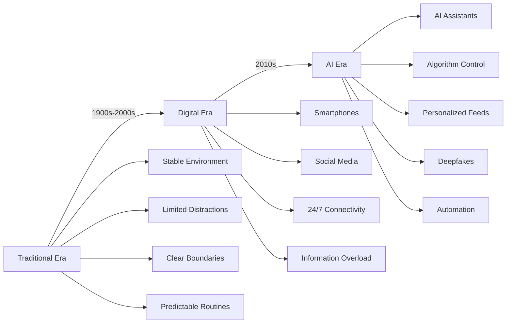
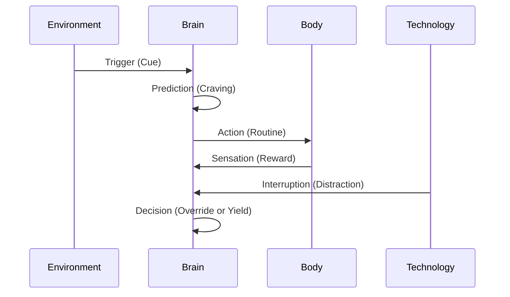
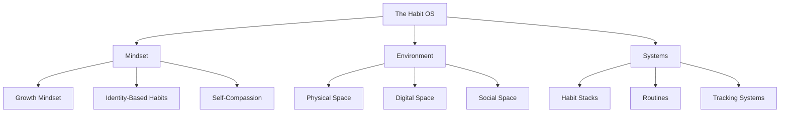

# Chapter 1: The Habit Revolution - Why Old Models Fail in the AI Era

> **"The world has changed. Our habits haven't kept up."**

---

## 🎯 Learning Objectives

By the end of this chapter, you will:
1. Understand why traditional habit models are insufficient for the modern world
2. Recognize the unique challenges of habit formation in the AI era
3. Identify the key differences between old and new habit paradigms
4. Appreciate the need for a comprehensive, integrated approach to behavior change

---

## 🌍 The World Has Changed

### The Habit Landscape: Then vs. Now



### The Attention Economy

In 2026, we live in an **attention economy** where:
- Companies compete for your attention like never before
- Algorithms are designed to maximize engagement, not well-being
- Notifications are engineered to create addiction
- Dopamine hits are carefully calibrated to keep you hooked

> **📊 Research Insight**
> The average person checks their phone **96 times per day** (Asurion, 2023). That's once every **10 minutes** during waking hours.

### The AI Revolution

Artificial Intelligence has fundamentally changed how we:
- **Access information** (instant, personalized answers)
- **Make decisions** (AI-assisted recommendations)
- **Create content** (AI-generated at scale)
- **Interact socially** (AI-mediated conversations)
- **Form habits** (AI-guided and optimized)

> **💡 Pro Tip**
> AI can be both a **powerful tool** for building better habits and a **dangerous distraction** that sabotages them.

---

## 🏛️ Why Traditional Models Fail

### Limitations of Existing Habit Books

| Book | Strengths | Limitations |
|------|-----------|-------------|
| Atomic Habits | Simple framework, practical advice | Limited neuroscience, no AI coverage |
| Tiny Habits | Behavioral science, easy implementation | Focuses on starting, not maintaining |
| The Power of Habit | Habit loop, scientific stories | Less actionable, heavy on storytelling |
| The 7 Habits | Personal leadership, values | Not modern, less neuroscience |

### The Gaps

None of these books address:
- **AI-powered distractions** that hijack attention
- **Algorithm-controlled feeds** that exploit psychology
- **Infinite notifications** that fragment focus
- **Remote work** that blurs boundaries
- **Information overload** that paralyzes decisions
- **Digital addiction** that rewires brains

---

## 🚀 The AI Era Challenges

### 1. Algorithm-Controlled Attention

Social media platforms use sophisticated algorithms to:
- Maximize engagement (not your well-being)
- Exploit psychological vulnerabilities
- Create infinite scroll experiences
- Trigger dopamine hits at optimal intervals

### 2. The Dopamine Economy

Modern apps are designed to **hijack your dopamine system**:
- TikTok: Short-form video every 3-10 seconds
- Instagram: Variable rewards (likes, comments)
- Twitter/X: Real-time notifications
- YouTube: Autoplay continuous content

> **📊 Research Insight**
> Variable rewards create **more addiction** than predictable rewards (Wolfram Schultz, 2016).

### 3. Information Overload

The average person in 2026:
- Receives **5,000+ advertisements per day**
- Has **200+ apps** on their phone
- Checks **12+ social media platforms**
- Spends **7+ hours** on screens daily

**Result:** Decision fatigue, analysis paralysis, cognitive overload.

### 4. The Blurring of Boundaries

Remote work has erased the lines between:
- Work and personal life
- Focus and distraction
- Productivity and procrastination
- Connection and isolation

### 5. AI Dependency

We're increasingly relying on AI for:
- **Remembering** (calendars, reminders)
- **Deciding** (recommendations, suggestions)
- **Creating** (writing, designing, coding)
- **Connecting** (chatbots, virtual assistants)

**Risk:** Losing our **cognitive abilities** and **independent thinking**.

---

## 🆕 The New Habit Paradigm

### What We Need Now

| Old Model | New Model (The Habit OS) |
|-----------|---------------------------|
| Isolated tips | Integrated system |
| Simple frameworks | Comprehensive approach |
| Individual habits | Holistic life design |
| Static advice | Dynamic, AI-assisted |
| One-size-fits-all | Personalized and adaptive |
| Theory-heavy | Action-focused |
| Text-based | Visual and interactive |

### The Habit OS Difference

**The Habit OS** is not just a book. It's a **complete operating system** that:
1. **Integrates multiple disciplines** (Psychology, Neuroscience, Behavioral Economics, AI, etc.)
2. **Addresses modern challenges** (Digital distractions, AI, remote work, etc.)
3. **Provides practical tools** (Diagnosis tests, worksheets, templates, etc.)
4. **Uses visual learning** (Diagrams, infographics, decision trees, etc.)
5. **Offers comprehensive coverage** (51 chapters, 300+ habits, 150+ exercises)

---

## 🧠 The Science of Modern Habit Formation

### The Updated Habit Loop

The traditional habit loop (Cue -> Routine -> Reward) needs an upgrade for the digital age:



### The Role of Technology

Technology can be:
- **Cue:** Reminder app (positive) vs. Notification spam (negative)
- **Craving:** Progress tracking (positive) vs. Infinite scroll (negative)
- **Action:** Habit tracker (positive) vs. Doomscrolling (negative)
- **Reward:** Achievement badge (positive) vs. Social media likes (negative)

---

## 🛠️ The Habit OS Solution

### 1. The Integrated Framework

```
Habit Success = (Motivation + Ability + Trigger) × Environment × Identity × Technology
```

**New factors:**
- **Technology:** How digital tools affect your habits
- **AI Assistance:** Using AI to optimize habit formation
- **Digital Wellness:** Managing technology use

### 2. The Three Pillars



### 3. The Modern Habit Stack

```
Personal Habits
  + Digital Habits
  + AI-Assisted Habits
  + Environmental Design
  + Accountability Systems
  = The Habit OS
```

---

## 🎯 Practical Applications

### How to Apply This Chapter

**1. Audit Your Digital Environment**
- List all apps on your phone
- Identify which ones help vs. hurt your habits
- Delete or limit the harmful ones

**2. Set Up Digital Boundaries**
- Turn off non-essential notifications
- Schedule focus time blocks
- Create app usage limits

**3. Start Your Habit Diagnosis**
- Take the full test in Appendix A
- Identify your biggest habit challenges
- Prioritize based on impact

**4. Choose Your Starting Point**
- If you struggle with **digital distractions** → Focus on Part 11 (AI Era Habits)
- If you need **better systems** → Start with Part 4 (Building Good Habits)
- If you want **deeper understanding** → Begin with Part 2 (Brain Science)

---

## ❌ Common Mistakes

❌ **Mistake:** Trying to apply old habit models without adapting them to the digital age
✅ **Fix:** Use frameworks that account for **modern distractions and AI**

❌ **Mistake:** Ignoring the impact of technology on your habits
✅ **Fix:** Audit your digital environment and **design it intentionally**

❌ **Mistake:** Relying on willpower alone in a world designed to distract you
✅ **Fix:** Build **systems and environments** that support your habits automatically

---

## 🤔 Myths vs. Evidence

| Myth | Evidence-Based Reality |
|------|------------------------|
| "Habits are just about repetition" | Habits require **cue, craving, response, AND reward** in the right environment |
| "Willpower is enough" | **Environment and systems** matter more than motivation in the digital age |
| "You can change habits by just trying harder" | **Neuroplasticity** requires the right conditions (sleep, nutrition, stress management) |
| "Technology is neutral" | Technology is **actively designed** to influence your behavior |

---

## 📝 Step-by-Step Implementation

### Your 7-Day Habit Revolution Plan

**Day 1: Audit** - List all your current habits (good and bad)
**Day 2: Eliminate** - Delete 3 apps that sabotage your habits
**Day 3: Design** - Create a morning routine
**Day 4: Track** - Choose 1-3 habits to track daily
**Day 5: Optimize** - Identify friction points
**Day 6: Automate** - Set up 1 AI-assisted habit
**Day 7: Review** - Assess progress and adjust

---

## 💭 Reflection Questions

1. What are the **biggest digital distractions** in your life?
2. How has **technology changed** your ability to form habits?
3. Which **old habit models** have you tried and why didn't they work?
4. What **one change** to your digital environment would have the biggest impact?

---

## ✍️ Exercise: Digital Habit Audit

List all apps and rate their impact on your habits (-2 to +2):

```markdown
| App | Daily Usage | Impact | Helps | Hurts | Action |
|-----|-------------|--------|-------|-------|--------|
| Example: Meditation App | 15 min | +2 | Yes | No | Keep |
| Example: Social Media | 2 hours | -2 | No | Yes | Limit |
```

---

## 📌 Summary

- The world has changed dramatically since traditional habit books were written
- Digital distractions, AI, and algorithm-controlled feeds present unique challenges
- Old models are insufficient for the modern habit landscape
- The Habit OS provides an integrated, comprehensive approach for the AI era

---

## ✅ Action Checklist

- [ ] Complete the **Digital Habit Audit** exercise
- [ ] Take the **Habit Diagnosis Test** in Appendix A
- [ ] Delete or limit **3 distracting apps**
- [ ] Set up **digital boundaries**
- [ ] Choose your **starting point** in The Habit OS

---

## 📚 References

1. Clear, J. (2018). *Atomic Habits*. Avery.
2. Fogg, B. J. (2019). *Tiny Habits*. Houghton Mifflin Harcourt.
3. Duhigg, C. (2012). *The Power of Habit*. Random House.
4. Newport, C. (2016). *Deep Work*. Grand Central Publishing.
5. Hari, J. (2022). *Stolen Focus*. Random House.
6. Schultz, W. (2016). Dopamine reward prediction-error signalling. *Nature Reviews Neuroscience*.