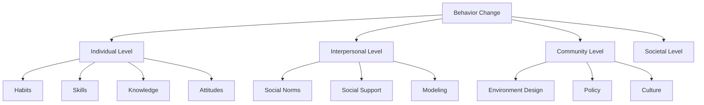
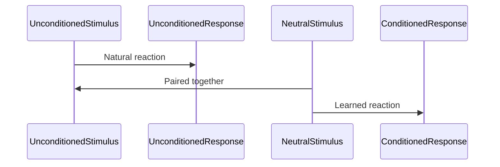
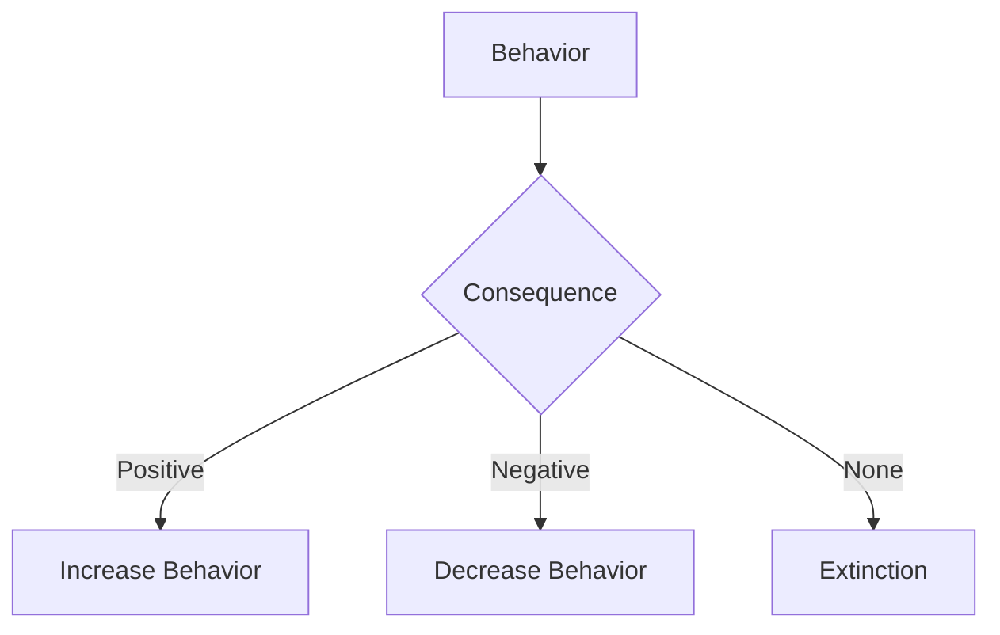
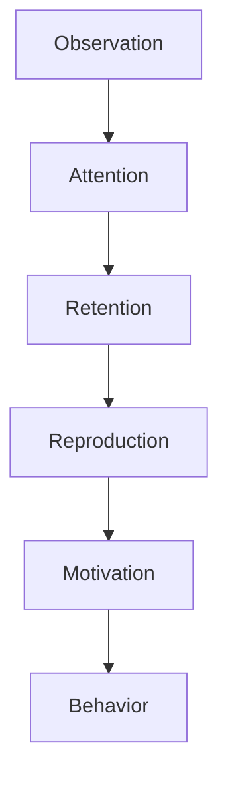
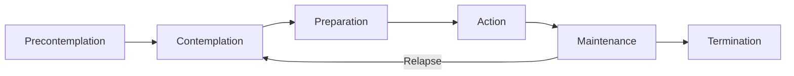
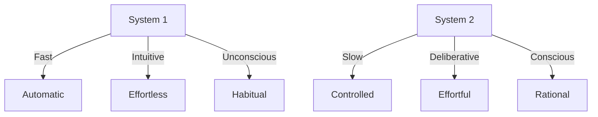
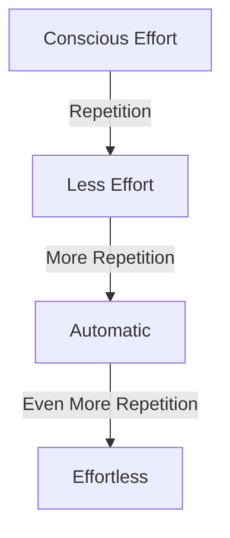
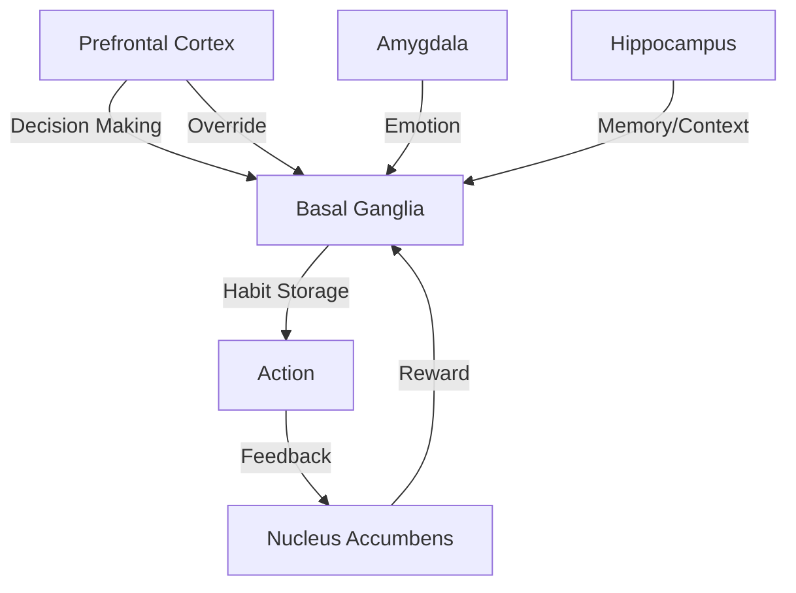
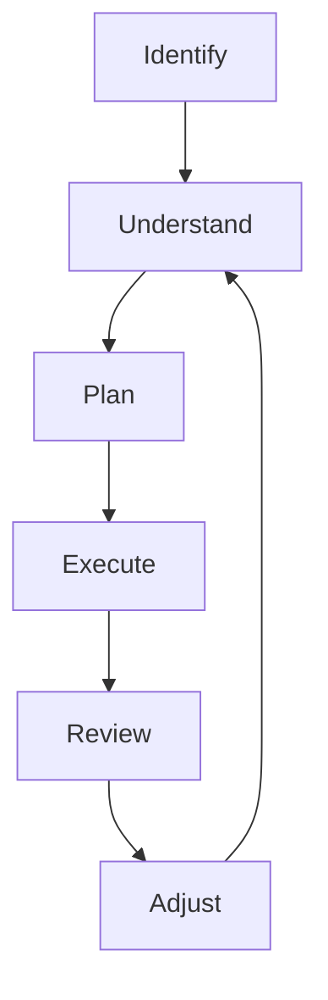

# Chapter 2: The Science of Behavior Change - From Theory to Practice

> **"Knowledge is power, but action is the key to success."**

---

## 🎯 Learning Objectives

By the end of this chapter, you will:
1. Understand the scientific foundations of behavior change
2. Learn key theories and models from psychology and neuroscience
3. Discover how to apply science to practical habit formation
4. Recognize the difference between knowing and doing

---

## 📚 The Foundation of Behavior Change

### The Behavior Change Spectrum



### Why Understanding Science Matters

Behavior change is not just about willpower or motivation. It's about understanding the **mechanisms** that drive human action and using that knowledge to design effective interventions.

> **📊 Research Insight**
> People who understand the science behind habit formation are **2-3x more successful** at creating lasting change (Milkman, 2021).

---

## 🧠 Key Theories of Behavior Change

### 1. Behaviorism: The Power of Conditioning

**Founders:** Ivan Pavlov, B.F. Skinner, John Watson

#### Classical Conditioning (Pavlov)



**Application to Habits:**
- Pair new habits with existing positive emotions
- Use environmental cues as conditioned stimuli
- Create automatic responses through repetition

#### Operant Conditioning (Skinner)



**Four Types of Consequences:**

| Type | Definition | Example | Effect on Habits |
|------|------------|---------|------------------|
| Positive Reinforcement | Adding a reward | Praise, money, pleasure | Increases good habits |
| Negative Reinforcement | Removing a negative | Turning off alarm, avoiding pain | Increases good habits |
| Positive Punishment | Adding a negative | Scolding, fine | Decreases bad habits |
| Negative Punishment | Removing a reward | Taking away privileges | Decreases bad habits |

**Application to Habits:**
- Use **positive reinforcement** to encourage good habits
- Use **negative punishment** to discourage bad habits
- Avoid **punishment** which can create resistance

---

### 2. Social Cognitive Theory (Bandura)

**Key Concept:** Learning occurs through observation and modeling



**The Four Processes:**
1. **Attention** - You must notice the behavior
2. **Retention** - You must remember what you observed
3. **Reproduction** - You must be able to perform the behavior
4. **Motivation** - You must have a reason to perform it

**Self-Efficacy:** Your belief in your ability to succeed

> **📊 Research Insight**
> People with **high self-efficacy** are more likely to attempt difficult tasks and persist in the face of obstacles (Bandura, 1997).

**Application to Habits:**
- Find **role models** who demonstrate the habits you want
- Start with **small wins** to build confidence
- Use **visualization** to rehearse success
- Celebrate **progress** to reinforce self-efficacy

---

### 3. Transtheoretical Model (Prochaska & DiClemente)

**Key Concept:** Behavior change is a process, not an event



**The Six Stages:**

| Stage | Description | Duration | Key Task |
|-------|-------------|----------|----------|
| Precontemplation | Not considering change | Variable | Raise awareness |
| Contemplation | Considering change | 6+ months | Weigh pros/cons |
| Preparation | Ready to change | 1 month | Make a plan |
| Action | Actively changing | 3-6 months | Implement plan |
| Maintenance | Sustaining change | 6+ months | Prevent relapse |
| Termination | No temptation | Permanent | Celebrate success |

---

### 4. Dual-Process Theory

**Key Concept:** Two systems drive behavior



**System 1 (Automatic):** Fast, automatic, effortless, handles habits and routines
**System 2 (Controlled):** Slow, deliberate, effortful, handles new and complex tasks

---

### 5. Habit Automaticity (Bargh, Lally)

**Key Concept:** Habits become automatic through repetition



> **📊 Research Insight**
> On average, it takes **66 days** for a behavior to become automatic (Lally et al., 2009).

---

## 🔬 The Neuroscience of Behavior Change

### The Brain's Role in Habit Formation



**Key Brain Regions:**
| Region | Function | Role in Habits |
|--------|----------|---------------|
| Prefrontal Cortex | Executive function, decision making | Overrides automatic habits, plans new ones |
| Basal Ganglia | Procedure learning, habit storage | Stores and executes habits automatically |
| Nucleus Accumbens | Reward processing | Drives habit formation through dopamine |

---

## 🔄 From Theory to Practice

### The Science-Based Habit Formation Framework



---

## 🛠️ Practical Applications

### Strategy 1: Use Multiple Theories Together
**Example: Creating an Exercise Habit**
| Theory | Application |
|--------|-------------|
| Operant Conditioning | Reward yourself after each workout |
| Social Cognitive Theory | Find a workout buddy |
| Transtheoretical Model | Start in Preparation stage with a plan |

### Strategy 2: Match Strategies to Your Stage
- **Precontemplation:** Raise awareness of the problem
- **Contemplation:** Weigh pros and cons
- **Preparation:** Make a specific plan
- **Action:** Implement the plan
- **Maintenance:** Prevent relapse

### Strategy 3: Design for Automaticity
1. **Start Tiny** - Make it so easy you cannot say no
2. **Use Cues** - Anchor to existing habits
3. **Repeat Consistently** - Same time, same place
4. **Remove Friction** - Make it as easy as possible
5. **Add Rewards** - Immediate satisfaction

---

## ❌ Common Mistakes & Fixes

❌ Trying to change behavior without understanding mechanisms
✅ Learn the **science** behind behavior change

❌ Using one-size-fits-all approaches
✅ **Match strategies** to your current stage

❌ Relying solely on willpower
✅ Design **automatic habits**

---

## 📝 Step-by-Step Implementation

### Your 30-Day Science-Based Habit Plan
**Week 1:** Foundation (Identify, Understand, Assess, Plan, Prepare, Create, Review)
**Week 2:** Action (Implement, Track, Overcome, Celebrate, Adjust)
**Week 3:** Refinement (Refine, Increase, Add, Deepen, Build)
**Week 4:** Maintenance (Sustain, Prevent, Maintain, Integrate, Review)

---

## 💭 Reflection Questions
1. Which behavior change theory resonates most with you?
2. What stage of change are you in for a habit you want to develop?
3. How can you apply multiple theories together?
4. What neuroscientific principles can you use?
5. What obstacles have prevented change in the past?

---

## ✍️ Exercise: Behavior Change Analysis
```markdown
## Habit Analysis: [Your Habit]
### Operant Conditioning
- Current consequences: _
- Desired reinforcement: _
### Social Cognitive Theory
- Role models: _
- Self-efficacy level (1-10): _
### Transtheoretical Model
- Current stage: _
- Next stage: _
```

---

## 📌 Summary
- Behavior change is a **science**
- **Multiple theories** explain habit formation
- **Neuroscience** reveals brain mechanisms
- **Practical application** requires theory + practice
- **Small, consistent actions** lead to lasting change

---

## ✅ Action Checklist
- [ ] Understand key theories of behavior change
- [ ] Identify which theories apply to your habit goals
- [ ] Assess your current stage of change
- [ ] Create a science-based plan
- [ ] Implement the plan using evidence-based strategies
- [ ] Track progress and adjust
- [ ] Review the science regularly

---

## 📚 References
1. Skinner, B. F. (1938). The Behavior of Organisms. Appleton-Century.
2. Pavlov, I. P. (1927). Conditioned Reflexes. Oxford University Press.
3. Bandura, A. (1977). Social Learning Theory. Prentice Hall.
4. Prochaska, J. O., & DiClemente, C. C. (1983). Stages of change. Journal of Consulting and Clinical Psychology.
5. Bargh, J. A. (1994). The four horsemen of automaticity. Handbook of Social Cognition.
6. Lally, P., et al. (2009). How are habits formed. European Journal of Social Psychology.
7. Kahneman, D. (2011). Thinking, Fast and Slow. Farrar, Straus and Giroux.
8. Milkman, K. (2021). How to Change. Portfolio.
9. Clear, J. (2018). Atomic Habits. Avery.
10. Fogg, B. J. (2019). Tiny Habits. Houghton Mifflin Harcourt.