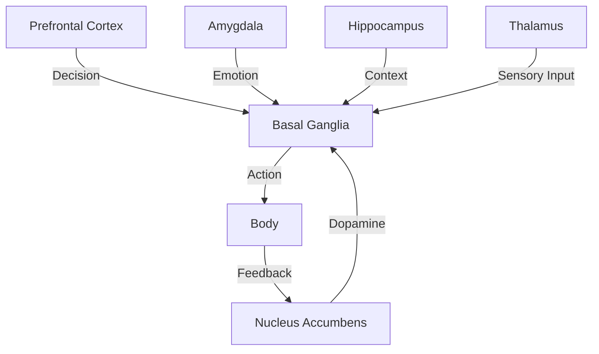
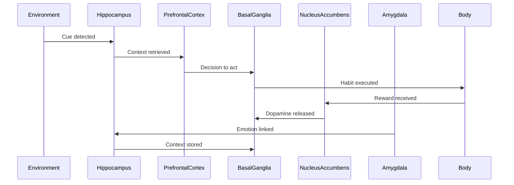

# Chapter 5: The Neuroscience of Habits - How Your Brain Really Works

> **"Your brain is the command center for all your habits."**

---

## 🎯 Learning Objectives
1. Understand the neural mechanisms of habit formation
2. Know the roles of key brain regions in habit behavior
3. Comprehend how neurotransmitters influence habits
4. Apply neuroscience principles to build better habits

---

## 🧠 The Brain's Habit Network

### The Habit Circuit

**How it works:**
1. **Cue Detection** - Hippocampus and prefrontal cortex detect a trigger
2. **Habit Retrieval** - Basal ganglia retrieves the stored habit pattern
3. **Action Execution** - Motor cortex executes the habit automatically
4. **Reward Processing** - Nucleus accumbens releases dopamine
5. **Memory Update** - Hippocampus stores the context

---

## 🏗️ Key Brain Regions in Habit Formation

### 1. Prefrontal Cortex: The CEO of Your Brain
**Functions:** Executive function, decision making, impulse control, working memory, social behavior
**Role in Habits:** Initiates new habits, overrides automatic habits, plans habit strategies
> **📊 Research Insight:** People with prefrontal cortex damage struggle with delayed gratification (Bechara et al., 2000).

### 2. Basal Ganglia: The Habit Storage Center
**Functions:** Habit storage, procedure learning, movement control, inhibition, dopamine regulation
**Role in Habits:** Stores habit patterns, executes habits automatically, strengthens habits through repetition
> **📊 Research Insight:** The basal ganglia takes over habit execution from the prefrontal cortex as habits become automatic (Graybiel, 2008).

### 3. Nucleus Accumbens: The Reward Center
**Functions:** Dopamine reception, reward processing, motivation, reinforcement learning, craving
**Role in Habits:** Releases dopamine, creates cravings, reinforces habit loops, drives motivation
> **📊 Research Insight:** The nucleus accumbens releases more dopamine for unexpected rewards (Schultz, 2016).

### 4. Amygdala: The Emotion Center
**Functions:** Fear processing, emotional memory, threat detection, arousal, aggression
**Role in Habits:** Links emotions to habit memories, creates emotional triggers, drives stress-related habits
> **📊 Research Insight:** Emotional memories are stronger and longer-lasting than neutral memories (McGaugh, 2004).

### 5. Hippocampus: The Memory Center
**Functions:** Memory formation, spatial navigation, context processing, pattern separation
**Role in Habits:** Stores context of habit formation, encodes habit triggers, links habits to environments
> **📊 Research Insight:** London taxi drivers have larger hippocampi due to memorizing complex streets (Maguire et al., 2000).

---

## 🔬 The Habit Loop in the Brain

---

## 🧩 The Neuroscience of Habit Formation

### Stage 1: Cognitive (Conscious Effort)
- Requires full attention and effort
- Prefrontal cortex is highly active
- Basal ganglia is learning the pattern
- High cognitive load, energy-intensive

### Stage 2: Associative (Semi-Automatic)
- Requires less conscious effort
- Prefrontal cortex monitors but doesn't fully control
- Basal ganglia is taking over execution
- Synaptic connections strengthening

### Stage 3: Autonomous (Automatic)
- Habit is fully automatic
- Basal ganglia executes without prefrontal cortex
- Minimal conscious thought required
- Strong, myelinated neural pathways

---

## 🔬 Neurotransmitters: The Brain's Chemical Messengers

### The Role of Dopamine
**The Dopamine-Habit Cycle:**
1. Cue triggers dopamine release
2. Dopamine creates craving and motivation
3. Action is performed to get the reward
4. Reward triggers more dopamine
5. Cycle repeats and strengthens the habit
> **📊 Research Insight:** Dopamine neurons fire in anticipation of reward, not just when receiving it (Schultz, 1997).

---

## 🛠️ Practical Applications

### How to Apply Neuroscience to Habit Formation
1. **Leverage the Habit Circuit** - Design habits that work with your brain's natural circuitry
2. **Use the Three Stages** - Match strategies to each stage of habit formation
3. **Optimize Your Neurochemistry** - Balance dopamine, serotonin, and cortisol

---

## ❌ Common Mistakes
❌ Trying to form habits without understanding brain mechanisms
✅ Learn how your brain forms habits and work with it

❌ Expecting habits to form instantly
✅ Understand that myelination takes time - be patient

❌ Ignoring dopamine's role
✅ Design satisfying rewards that trigger dopamine

---

## 📝 Step-by-Step Implementation
### Your 30-Day Neuroscience-Based Habit Plan
**Week 1:** Understand and Prepare
**Week 2:** Cognitive Stage
**Week 3:** Associative Stage
**Week 4:** Autonomous Stage

---

## ✅ Action Checklist
- [ ] Understand the habit circuit and key brain regions
- [ ] Identify which brain regions are involved in your target habits
- [ ] Design habits that work with your brain's natural circuitry
- [ ] Leverage the three stages of habit formation
- [ ] Optimize your neurochemistry for habit success

---

## 📚 References
1. Graybiel, A. M. (2008). Habits, rituals, and the evaluative brain. Annual Review of Neuroscience.
2. Schultz, W. (2016). Dopamine reward prediction-error signalling. Nature Reviews Neuroscience.
3. Maguire, E. A., et al. (2000). Navigation-related structural change in the hippocampi of taxi drivers. PNAS.
4. McGaugh, J. L. (2004). The amnesic syndrome. Annual Review of Neuroscience.
5. Draganski, B., et al. (2004). Neuroplasticity: changes in grey matter induced by training. Nature.
6. Bargh, J. A., & Chartrand, T. L. (1999). The unbearable automaticity of being. American Psychologist.
7. Duhigg, C. (2012). The Power of Habit. Random House.
8. Clear, J. (2018). Atomic Habits. Avery.
9. Fogg, B. J. (2019). Tiny Habits. Houghton Mifflin Harcourt.
10. Kandel, E. R. (2000). Principles of Neural Science. McGraw-Hill.