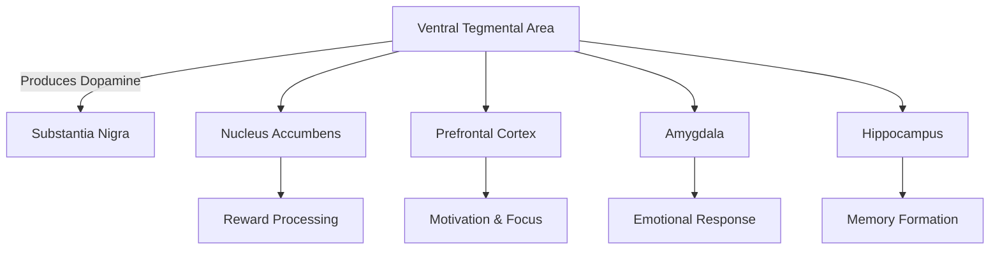
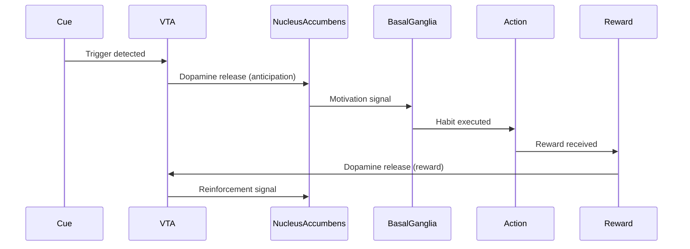
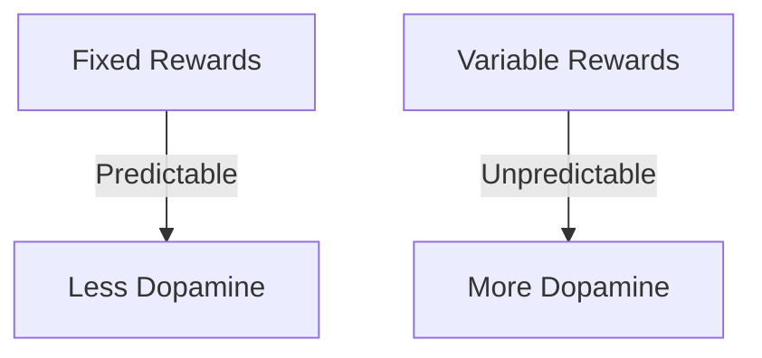

# Chapter 6: Dopamine, Reward, and the Modern Attention Economy

> **"Dopamine is the currency of habit formation."**

---

## 🎯 Learning Objectives
1. Understand dopamine's role in habit formation
2. Learn how the reward system drives behavior
3. Discover how technology exploits dopamine
4. Apply dopamine principles to build better habits

---

## 🧠 Dopamine 101
**What is Dopamine?** Neurotransmitter for motivation, reward, learning, movement, cognition.

### The Dopamine System


---

## 🔄 The Reward Circuit


**The Process:**
1. Cue Detection
2. Dopamine Release (Anticipation)
3. Motivation
4. Action
5. Reward
6. Dopamine Release (Reward)
7. Learning

> **📊 Research Insight:** Dopamine neurons fire most strongly when reward is better than expected (Schultz, 2016).

---

## 🎯 Dopamine in Habit Formation

### 1. Dopamine and Motivation
**Motivation Equation:** Motivation = Dopamine × Expectation × Value
- **Increase dopamine** through exercise, sleep, nutrition
- **Increase expectation** by setting clear goals
- **Increase value** by choosing meaningful rewards

### 2. Dopamine and Learning
**Prediction Error:**
- Positive error (better than expected) → More dopamine → Strengthens habit
- Negative error (worse than expected) → Less dopamine → Weakens habit

### 3. Dopamine and Reinforcement
Reinforcement Learning: State → Action → New State → Reward → Dopamine → Reinforce

---

## 🚨 The Attention Economy: How Technology Exploits Dopamine

### 1. Variable Rewards

**Examples:** Social Media likes, Gambling, Email notifications, News Feeds
> **📊 Research Insight:** Variable rewards create 2-3x more dopamine than fixed rewards (Wolfram Schultz, 2016).

### 2. Infinite Scroll and Autoplay
**The Infinite Loop:** Each new content piece → Small dopamine hit → Anticipation of next hit → Keep going
**Examples:** TikTok, YouTube Autoplay, Instagram Infinite Scroll, Netflix Autoplay

### 3. Notifications: The Dopamine Injection
**The Notification Cycle:** Notification → Alert response → Anticipation → Dopamine release → Open app → Variable reward → More dopamine
> **📊 Research Insight:** Average person checks phone within 3 minutes of notification (Asurion, 2023).

### 4. Social Validation: The Likes Economy
**The Social Reward System:** Post content → Anticipation → Each like/comment/share → Dopamine release → More engagement → More dopamine

### 5. Fear of Missing Out (FOMO)
**The FOMO Cycle:** See others' posts → Fear of missing out → Anxiety/urgency → Check more often → More dopamine hits

---

## 🛡️ How to Protect Your Dopamine System

### 1. Take Back Control of Your Attention
- Turn off notifications
- Schedule check-in times
- Use grayscale mode
- Delete distracting apps
- Create tech-free zones

### 2. Design Your Own Dopamine Rewards
| Unhealthy Source | Healthy Alternative | Dopamine Effect |
|------------------|---------------------|-----------------|
| Social media likes | Exercise | Higher, more sustained |
| Junk food | Healthy meals | More consistent |
| Online shopping | Saving money | Delayed but bigger |

### 3. Rewire Your Brain with Better Habits
**Steps:** Identify bad habit → Replace with good habit → Start small → Be consistent → Celebrate wins → Be patient

### 4. Practice Dopamine Detox
**30-Day Dopamine Reset:**
- Week 1: Awareness (track triggers, notice cravings)
- Week 2: Reduction (eliminate worst triggers, replace with alternatives)
- Week 3: Replacement (build new healthy dopamine sources)
- Week 4: Maintenance (sustain healthy habits)

---

## 🛠️ Practical Applications

### Strategy 1: The Dopamine Audit
Track your dopamine triggers for one week:
```markdown
| Time | Trigger | Source | Healthiness (1-5) | Alternative |
|------|---------|--------|------------------|-------------|
```

### Strategy 2: The Dopamine Stacking Technique
Combine multiple healthy dopamine sources:
**Example Morning Routine:**
1. Exercise (endorphins + dopamine)
2. Cold shower (adrenaline + dopamine)
3. Healthy breakfast (nutrients + dopamine)
4. Meditation (serotonin + dopamine)
5. Sunlight (vitamin D + dopamine)

### Strategy 3: The Dopamine Budget
Allocate dopamine intentionally:
```markdown
## Weekly Dopamine Budget
### High-Dopamine Activities (Limit to 2-3 per day)
- Social media: 30 min/day
- Video games: 1 hour/day
### Medium-Dopamine Activities (2-3 per day)
- Exercise: 30-60 min
- Creative hobbies: 1 hour
### Low-Dopamine Activities (Unlimited)
- Reading, Walking, Meditation, Learning
```

---

## ❌ Common Mistakes
❌ Not understanding how technology exploits dopamine
✅ Educate yourself on dopamine and habit formation

❌ Trying to resist dopamine triggers through willpower alone
✅ Remove the triggers from your environment

❌ Replacing bad dopamine habits with nothing
✅ Replace with healthy alternatives

---

## 📝 Step-by-Step Implementation
### Your 30-Day Dopamine Reset Plan
**Week 1:** Awareness and Audit
**Week 2:** Reduction and Replacement
**Week 3:** Building Better Habits
**Week 4:** Maintenance and Growth

---

## ✅ Action Checklist
- [ ] Understand how dopamine drives habit formation
- [ ] Identify your current dopamine triggers
- [ ] Audit your dopamine sources
- [ ] Eliminate worst dopamine triggers
- [ ] Replace with healthy alternatives
- [ ] Design your own dopamine rewards
- [ ] Create a dopamine budget
- [ ] Practice dopamine detox

---

## 📚 References
1. Schultz, W. (2016). Dopamine reward prediction-error signalling. Nature Reviews Neuroscience.
2. Volkow, N. D., et al. (2011). Reward, dopamine and the control of food intake. Trends in Cognitive Sciences.
3. Duhigg, C. (2012). The Power of Habit. Random House.
4. Hari, J. (2022). Stolen Focus. Random House.
5. Lustig, R. H. (2017). The Hacking of the American Mind. Avery.
6. Eyal, N. (2014). Hooked: How to Build Habit-Forming Products. Portfolio.
7. Rescorla, R. A., & Wagner, A. R. (1972). A theory of Pavlovian conditioning. Classical Conditioning II.
8. Schultz, W., et al. (1997). A neural substrate of prediction and reward. Science.
9. Berridge, K. C., & Robinson, T. E. (1998). What is the role of dopamine in reward. Brain Research Reviews.
10. Wise, R. A. (2004). Dopamine, learning and motivation. Nature Reviews Neuroscience.