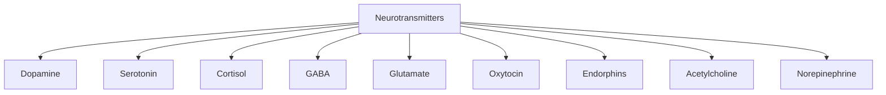
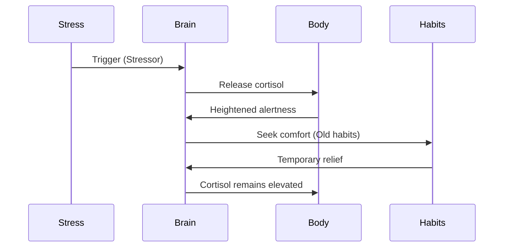
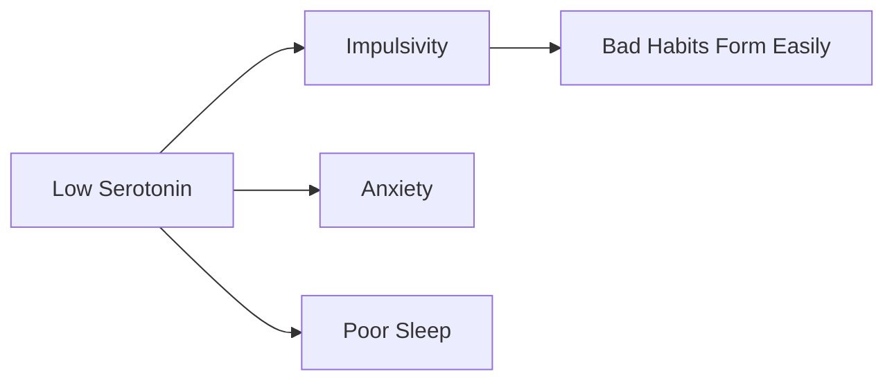
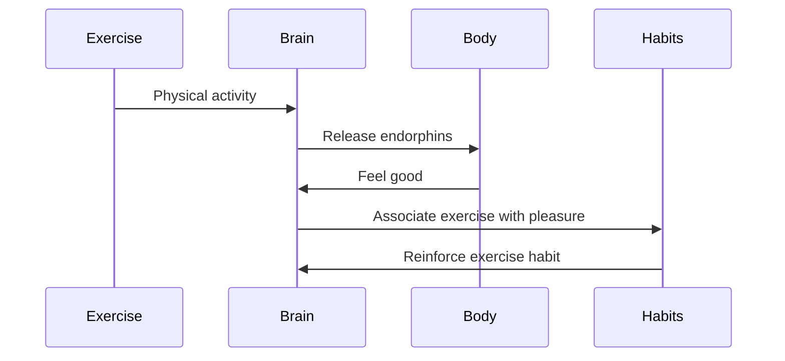

# Chapter 7: The Role of Cortisol, Serotonin, and Other Key Neurotransmitters

> **"Your brain chemistry determines your habit chemistry."**

---

## 🎯 Learning Objectives
1. Understand cortisol's role in stress and habit formation
2. Learn how serotonin affects mood, motivation, and habits
3. Discover functions of other key neurotransmitters (GABA, glutamate, oxytocin, endorphins)
4. Recognize how neurotransmitter imbalances affect habits
5. Apply neurotransmitter knowledge to optimize habit formation

---

## 🧠 The Neurotransmitter Orchestra
Your brain uses chemical messengers to communicate. Each plays a unique role in habit formation:

| Neurotransmitter | Primary Role | Impact on Habits |
|-----------------|--------------|------------------|
| Dopamine | Reward, motivation | Drives habit repetition through pleasure |
| Serotonin | Mood, well-being | Affects patience and long-term habit maintenance |
| Cortisol | Stress response | Can trigger or disrupt habits under stress |
| GABA | Inhibition | Calms the brain, reduces impulsive habits |
| Glutamate | Excitation | Enhances learning and habit memory formation |
| Oxytocin | Social bonding | Supports social habit formation |
| Endorphins | Pain relief | Creates natural highs that reinforce habits |

---

## 🔥 Cortisol: The Stress-Habit Connection

### What is Cortisol?
Primary stress hormone that increases blood sugar, enhances brain glucose use, suppresses non-essential functions.

### The Cortisol-Habit Cycle

### The Dark Side of Cortisol
Chronic cortisol elevation leads to:
- ❌ Increased cravings for high-calorie foods
- ❌ Reduced willpower and self-control
- ❌ Impaired memory and learning
- ❌ Sleep disruption
- ❌ Anxiety and depression
> **📊 Research Insight:** Chronic stress shrinks the hippocampus and enlarges the amygdala (Lupien et al., 2009).

### Managing Cortisol for Better Habits
1. Exercise Regularly
2. Practice Mindfulness
3. Prioritize Sleep
4. Social Connection
5. Healthy Nutrition
6. Laughter and Play

---

## ☀️ Serotonin: The Mood-Habit Stabilizer

### What is Serotonin?
Feel-good neurotransmitter regulating mood, sleep, appetite, digestion, memory, sexual desire.
**90% produced in the gut!**

### Serotonin and Habit Formation
1. **Patience and Delayed Gratification** - Higher serotonin = better impulse control
2. **Mood Regulation** - Stable mood = consistent habit practice
3. **Sleep Quality** - Serotonin converts to melatonin

### Boosting Serotonin Naturally
| Activity | Effect | Habit Benefit |
|----------|--------|---------------|
| Sunlight exposure | ↑↑↑ | Improves mood, regulates sleep |
| Exercise | ↑↑↑ | Reduces anxiety, builds discipline |
| Healthy diet (tryptophan) | ↑↑ | Better impulse control |
| Meditation | ↑↑ | Reduces stress, improves focus |

**Foods rich in tryptophan:** Turkey, chicken, eggs, cheese, milk, nuts, seeds, tofu, salmon

---

## 🧘 GABA: The Brain's Brakes

### What is GABA?
Primary inhibitory neurotransmitter that calms neural activity, reduces anxiety, promotes relaxation.

### GABA and Habit Formation
1. **Reduces Anxiety** - Anxiety makes it hard to start new habits
2. **Prevents Overwhelm** - Too much excitement = decision paralysis
3. **Supports Sleep** - GABA promotes deep sleep, crucial for habit memory

### Boosting GABA Naturally
- Exercise (especially yoga and tai chi)
- Meditation and deep breathing
- Foods: Cherries, tomatoes, walnuts, almonds, bananas, broccoli, spinach
- Herbs: Valerian root, passionflower, chamomile

---

## ⚡ Glutamate: The Brain's Accelerator

### What is Glutamate?
Primary excitatory neurotransmitter enhancing neural communication, learning, memory, neuroplasticity.

### Glutamate and Habit Formation
1. **Learning New Habits** - Strengthens synaptic connections
2. **Memory Consolidation** - Helps encode habit memories
3. **Glutamate-Dopamine Connection** - Glutamate neurons trigger dopamine release
> **⚠️ Warning:** Too much glutamate = excitotoxicity (can damage neurons).

### Optimizing Glutamate for Habits
- Learn new things
- Challenge yourself
- Get enough magnesium
- Avoid excess caffeine

---

## 🤝 Oxytocin: The Social Habit Glue

### What is Oxytocin?
Love and bonding hormone creating social bonds, trust, reducing fear, promoting generosity.

### Oxytocin and Habit Formation
1. **Social Habits** - Makes social habits more rewarding
2. **Trust and Accountability** - Higher oxytocin = more likely to seek help
3. **Reduces Fear of Change** - New habits can be scary

### Boosting Oxytocin for Better Habits
- Social exercise (group classes, team sports)
- Physical touch (hugs, handshakes)
- Acts of kindness
- Social bonding (deep conversations)
- Pet ownership

---

## 🏃 Endorphins: The Natural High

### What are Endorphins?
Body's natural painkillers and mood boosters reducing pain, creating euphoria, reducing stress, boosting mood.

### Endorphins and Habit Formation
**The endorphin-habit connection:**

### Triggering Endorphin Release
- Exercise (especially prolonged, moderate-intensity)
- Laughter
- Spicy foods
- Dark chocolate
- Meditation
- Sex
- Music
- Dancing

---

## 🧩 Acetylcholine: The Learning Neurotransmitter

### What is Acetylcholine?
Crucial for learning, memory, muscle activation, REM sleep, focus and attention.

### Acetylcholine and Habit Formation
1. **Habit Learning** - Essential for encoding new habit patterns
2. **Muscle Memory** - Important for physical habits
3. **Focus and Attention** - Helps notice habit cues

### Boosting Acetylcholine
- Eat choline-rich foods: Eggs, liver, fish, nuts, cauliflower, broccoli
- Exercise regularly
- Get enough sleep (especially REM sleep)
- Learn new skills

---

## ⚡ Norepinephrine: The Focus Neurotransmitter

### What is Norepinephrine?
Neurotransmitter and hormone increasing alertness, enhancing focus, boosting energy, triggering fight-or-flight.

### Norepinephrine and Habit Formation
1. **Attention to Cues** - Heightens awareness of habit triggers
2. **Focus During Practice** - Keeps you engaged in the habit
3. **Memory Encoding** - Strengthens memory of habit performance

### Optimizing Norepinephrine
- Exercise (especially high-intensity)
- Cold exposure (cold showers, ice baths)
- Novelty (new experiences)
- Caffeine (in moderation)
- Tyrosine-rich foods: Almonds, avocados, bananas, pumpkin seeds

---

## 🔬 Neurotransmitter Imbalances and Habits

| Imbalance | Symptoms | Impact on Habits |
|-----------|----------|------------------|
| Low Dopamine | Lack of motivation | Hard to start or maintain habits |
| Low Serotonin | Depression, anxiety | Emotional eating, procrastination |
| High Cortisol | Chronic stress | Stress-induced habit relapse |
| Low GABA | Anxiety, restlessness | Difficulty relaxing |
| High Glutamate | Anxiety, restlessness | Overstimulation |
| Low Oxytocin | Social anxiety | Avoidance of social habits |

---

## 🛠️ Practical Applications

### Neurotransmitter-Balancing Routine
**Morning (Cortisol & Norepinephrine):** Sunlight, Exercise, Cold shower
**Afternoon (Dopamine & Acetylcholine):** Learn new things, Complete challenging tasks, Social interaction
**Evening (Serotonin & GABA):** Relaxing activities, Healthy dinner, Wind down routine

### Neurotransmitter-Habit Matching System
| Habit | Primary Neurotransmitter | Secondary Neurotransmitters |
|-------|---------------------------|-------------------------------|
| Exercise | Endorphins, Dopamine | Norepinephrine, Serotonin |
| Meditation | GABA, Serotonin | Dopamine |
| Socializing | Oxytocin | Dopamine, Serotonin |
| Learning | Acetylcholine, Glutamate | Dopamine |

---

## ❌ Common Mistakes
❌ Ignoring brain chemistry in habit formation
✅ Understand neurotransmitters are the biological foundation

❌ Trying to force habits when neurotransmitters are imbalanced
✅ Balance brain chemistry first through lifestyle changes

❌ Relying only on dopamine for motivation
✅ Build a balanced neurotransmitter profile

---

## 📝 Step-by-Step Implementation
### Your 7-Day Neurotransmitter Reset
**Day 1:** Assess - Neurotransmitter self-assessment
**Day 2:** Exercise - 30 min (boost dopamine, endorphins, norepinephrine)
**Day 3:** Sunlight - 20 min (boost serotonin)
**Day 4:** Socialize - Meaningful interaction (boost oxytocin)
**Day 5:** Meditate - 10 min (boost GABA, serotonin)
**Day 6:** Learn - New skill (boost acetylcholine, glutamate)
**Day 7:** Sleep - 7-9 hours (regulate all neurotransmitters)

---

## ✅ Action Checklist
- [ ] Complete Neurotransmitter Self-Assessment
- [ ] Identify biggest neurotransmitter imbalance
- [ ] Create 7-Day Neurotransmitter Reset Plan
- [ ] Implement 3 neurotransmitter-boosting habits
- [ ] Map current habits to neurotransmitters
- [ ] Research specific foods/activities for imbalances

---

## 📚 References
1. Bear, M. F., et al. (2020). Neuroscience: Exploring the Brain. Lippincott Williams & Wilkins.
2. Lupien, S. J., et al. (2009). Effects of stress on the brain. Nature Reviews Neuroscience.
3. Schultz, W. (2016). Dopamine reward prediction-error signalling. Nature Reviews Neuroscience.
4. Young, S. N. (2007). How to increase serotonin in the human brain. Journal of Psychiatry & Neuroscience.
5. Cryan, J. F., & Kaupmann, K. (2005). GABA: the quiet revolution in neuroscience. Trends in Neurosciences.
6. Herman, J. P., et al. (2003). Central mechanisms of stress integration. Frontiers in Neuroendocrinology.
7. Carter, C. S. (1998). Developmental consequences of oxytocin. Physiology & Behavior.
8. Boecker, H., et al. (2008). The runner's high. Cerebral Cortex.
9. McGaugh, J. L. (2004). The amnesic syndrome. Annual Review of Neuroscience.
10. Draganski, B., et al. (2004). Neuroplasticity: changes in grey matter. Nature.