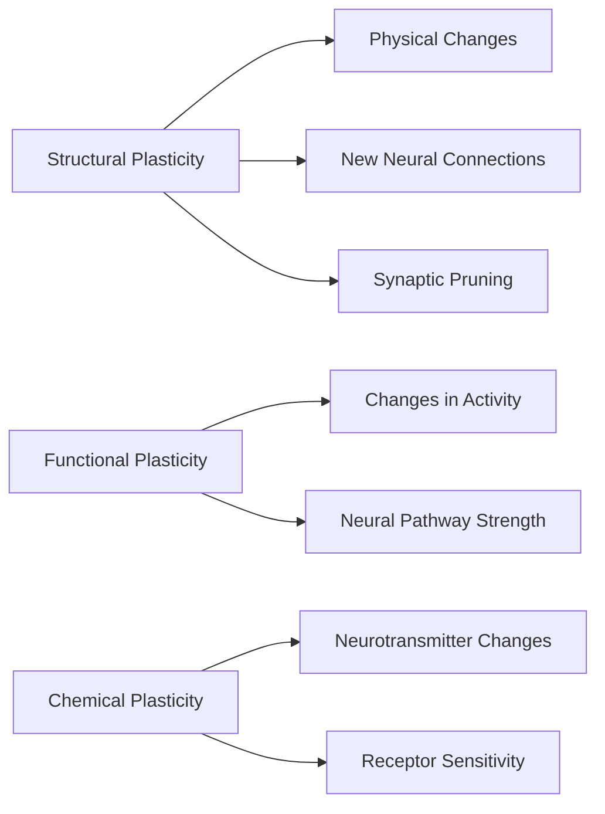

# Chapter 8: Neuroplasticity - Rewiring Your Brain for Success

> **"Neurons that fire together, wire together." - Donald Hebb**

---

## 🎯 Learning Objectives
1. Understand neuroplasticity and its importance for habit formation
2. Learn how the brain physically changes when forming new habits
3. Discover the different types of neuroplasticity
4. Recognize factors that enhance or inhibit neuroplasticity
5. Apply neuroplasticity principles to accelerate habit formation
6. Overcome common neuroplasticity barriers

---

## 🧠 The Plastic Brain

### What is Neuroplasticity?
Your brain's ability to change its structure and function, adapt to new experiences, rewire itself, recover from injury, and learn new skills and habits.
> **💡 Key Insight:** Your brain is **not hardwired** - it's constantly changing based on thoughts, actions, and experiences.

### The Neuroplasticity Spectrum

### The Science of Habit Formation
When you form a new habit, your brain undergoes physical changes:
1. New synaptic connections form between neurons
2. Existing connections strengthen with repetition
3. Neural pathways become more efficient
4. Gray matter density increases in relevant areas
5. Myelin sheath thickens, speeding up neural communication

---

## 🔄 Types of Neuroplasticity

### 1. Structural Neuroplasticity
**Physical changes in brain structure:**
| Type | Description | Example in Habits |
|------|-------------|-------------------|
| Synaptogenesis | Formation of new synapses | Learning a new habit |
| Synaptic Pruning | Elimination of weak synapses | Old habits fade |
| Dendritic Growth | Growth of neuron branches | More habit options |
| Neurogenesis | Creation of new neurons | Primarily in hippocampus |
| Myelination | Insulation of neural pathways | Makes habits faster |
> **📊 Research Insight:** London taxi drivers have larger hippocampi (Maguire et al., 2000).

### 2. Functional Neuroplasticity
Changes in how brain areas function:
- **Cortical Remapping:** Other senses take over damaged areas
- **Compensatory Masculinization:** Other regions compensate for damage
- **Cross-Modal Plasticity:** Sensory areas process different information types

### 3. Chemical Neuroplasticity
Changes in brain chemistry:
- Neurotransmitter production increases/decreases
- Receptor sensitivity changes
- Gene expression alters protein production
- Neurotrophins promote neural growth

---

## 🧩 The Habit Loop and Neuroplasticity

### The Four Stages of Habit Neuroplasticity

**Stage 1: Awareness (Cortex-Dependent)**
- Requires conscious effort
- Prefrontal cortex highly active
- Neural pathways weak
- Energy-intensive

**Stage 2: Practice (Basal Ganglia Learning)**
- Repetition begins
- Basal ganglia starts encoding
- Cortex activity decreases
- Synaptic connections strengthen

**Stage 3: Automaticity (Basal Ganglia Control)**
- Habit becomes automatic
- Basal ganglia takes over
- Cortex activity minimal
- Strong, myelinated pathways

**Stage 4: Mastery (Effortless Execution)**
- Habit is fully automatic
- Minimal conscious thought
- Highly efficient neural pathways
- Triggered by cues without awareness

---

## 🔬 The Neuroscience of Habit Formation

### Key Brain Areas in Habit Formation
| Brain Area | Role in Habits | Neuroplastic Changes |
|------------|---------------|---------------------|
| Prefrontal Cortex | Decision-making, willpower | Strengthens with practice |
| Basal Ganglia | Habit storage and execution | Encodes habit patterns |
| Nucleus Accumbens | Reward processing | Increases sensitivity |
| VTA | Dopamine production | Releases dopamine |
| Amygdala | Emotion and memory | Links emotions to habits |
| Hippocampus | Context and memory | Stores habit context |

---

## ⚡ Factors That Influence Neuroplasticity

### Enhancers of Neuroplasticity
| Factor | Effect | How to Apply |
|--------|--------|-------------|
| Repetition | Strengthens pathways | Practice consistently |
| Intensity | Creates stronger connections | Focus deeply |
| Novelty | Stimulates new connections | Make practice engaging |
| Attention | Enhances learning | Be fully present |
| Emotion | Strengthens memory | Associate positive emotions |
| Sleep | Consolidates learning | Get quality sleep |
| Exercise | Boosts BDNF | Exercise regularly |
| Nutrition | Provides building blocks | Eat brain-healthy foods |

### Inhibitors of Neuroplasticity
| Factor | Effect | How to Overcome |
|--------|--------|-----------------|
| Chronic Stress | Damages neurons | Practice stress-reduction |
| Poor Sleep | Impairs memory | Prioritize quality sleep |
| Malnutrition | Deprives brain | Eat balanced diet |
| Sedentary Lifestyle | Reduces BDNF | Incorporate activity |
| Chronic Inflammation | Damages neurons | Reduce inflammation |

---

## 🧬 Brain-Derived Neurotrophic Factor (BDNF)

### What is BDNF?
Protein that supports neuron survival, growth of new neurons, strengthens synaptic connections, enhances learning and memory.
> **💡 Key Insight:** BDNF is like **fertilizer for your brain**, making neuroplasticity possible.

### BDNF and Habit Formation
1. **Accelerates Learning** - Faster habit acquisition
2. **Strengthens Memory** - Better habit recall
3. **Enhances Neuroplasticity** - More permanent neural changes
4. **Protects Against Stress** - Buffers cortisol effects

### Boosting BDNF Naturally
| Activity | BDNF Increase | Habit Application |
|----------|---------------|--------------------|
| Exercise (aerobic) | 200-300% | Exercise before/after habit practice |
| Intermittent Fasting | 50-200% | Try time-restricted eating |
| Omega-3 Fatty Acids | 50-100% | Eat fatty fish, flaxseeds |
| Curcumin | 50-100% | Add turmeric to diet |
| Learning New Skills | 50% | Challenge your brain |

---

## 🎯 Practical Neuroplasticity: Rewiring Your Brain

### The 30-Day Neuroplasticity Challenge
**Day 1-7:** Disruption (Old pathways resist, new synapses form)
**Day 8-14:** Adaptation (New pathways strengthen, effort decreases)
**Day 15-21:** Integration (Habit more automatic, basal ganglia takes over)
**Day 22-30:** Automation (Habit mostly automatic, minimal effort)

### Neuroplasticity-Based Strategies
1. **Spaced Repetition Method** - Practice at increasing intervals
2. **Interleaving Technique** - Mix different habits together
3. **Context Variation Method** - Practice in different contexts
4. **Emotional Tagging Technique** - Associate strong positive emotions
5. **Sleep Optimization Strategy** - Sleep consolidates neural changes

---

## 🧠 Breaking Bad Habits with Neuroplasticity

### Why Bad Habits Are Hard to Break
1. Established Neural Pathways
2. Dopamine Reinforcement
3. Emotional Associations
4. Automaticity
5. Cue Sensitivity

### The Neuroplasticity Approach
1. **Weaken the Existing Pathway** - Avoid triggers, delay habit, replace reward
2. **Strengthen Alternative Pathways** - Create competing habits, practice new responses
3. **Rewire Reward System** - Identify real need, find healthier ways, retrain brain

### The 4-Step Method
1. **Identify the Cue** - What triggers the bad habit?
2. **Disrupt the Pattern** - Avoid cue, create obstacles, delay action
3. **Replace the Habit** - Choose healthier alternative, make it easy
4. **Reinforce the Change** - Celebrate wins, track progress, be patient

---

## ❌ Common Mistakes
❌ Expecting instant results
✅ Neural changes take time - be patient

❌ Not practicing consistently
✅ Repetition is key - practice daily

❌ Trying to change too many habits at once
✅ Focus on one habit at a time

❌ Ignoring sleep's role
✅ Prioritize sleep - it consolidates learning

---

## 📝 Step-by-Step Implementation
### Your 30-Day Brain Rewiring Plan
**Week 1:** Foundation (Educate, Assess, Choose, Plan, Prepare, Start, Reflect)
**Week 2:** Practice (Consistent daily practice, use techniques, track progress)
**Week 3:** Strengthen (Increase challenge, add variation, focus on emotion)
**Week 4:** Automate (Habits feel automatic, reduce effort, celebrate, plan maintenance)

---

## ✅ Action Checklist
- [ ] Understand neuroplasticity basics
- [ ] Assess current habits to change
- [ ] Learn about neuroplasticity factors
- [ ] Create 30-day neuroplasticity challenge
- [ ] Apply neuroplasticity-based strategies
- [ ] Track progress using journal
- [ ] Optimize lifestyle for neuroplasticity
- [ ] Reflect on journey and celebrate wins

---

## 📚 References
1. Doidge, N. (2007). The Brain That Changes Itself. Viking.
2. Begley, S. (2007). Train Your Mind, Change Your Brain. Ballantine Books.
3. Merzenich, M. M. (2013). Soft-Wired. Parnassus Publishing.
4. Maguire, E. A., et al. (2000). Navigation-related structural change. PNAS.
5. Draganski, B., et al. (2004). Neuroplasticity: changes in grey matter. Nature.
6. Kleim, J. A., & Jones, T. A. (2008). Principles of experience-dependent neural plasticity. Journal of Speech, Language, and Hearing Research.
7. Cotman, C. W., & Berchtold, N. C. (2002). Exercise: a behavioral intervention. Trends in Neurosciences.
8. Voss, M. W., et al. (2013). Plasticity of brain networks. Frontiers in Aging Neuroscience.
9. Ratey, J. J. (2008). Spark: The Revolutionary New Science of Exercise and the Brain. Little, Brown Spark.
10. Doidge, N. (2015). The Brain's Way of Healing. Viking.