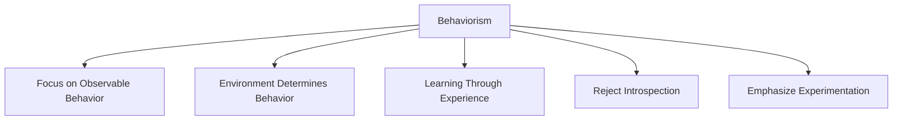
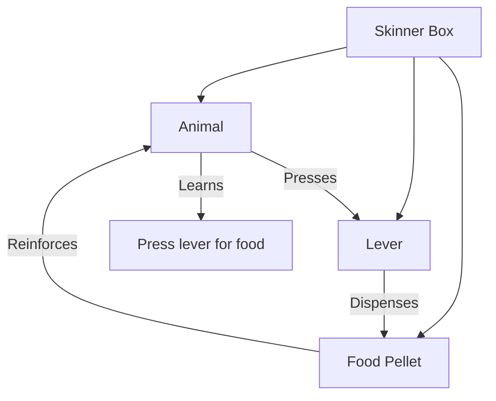
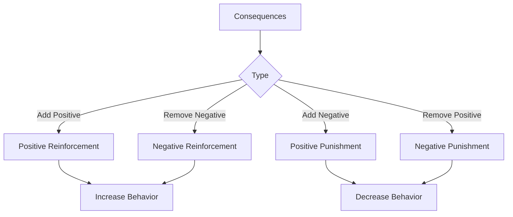
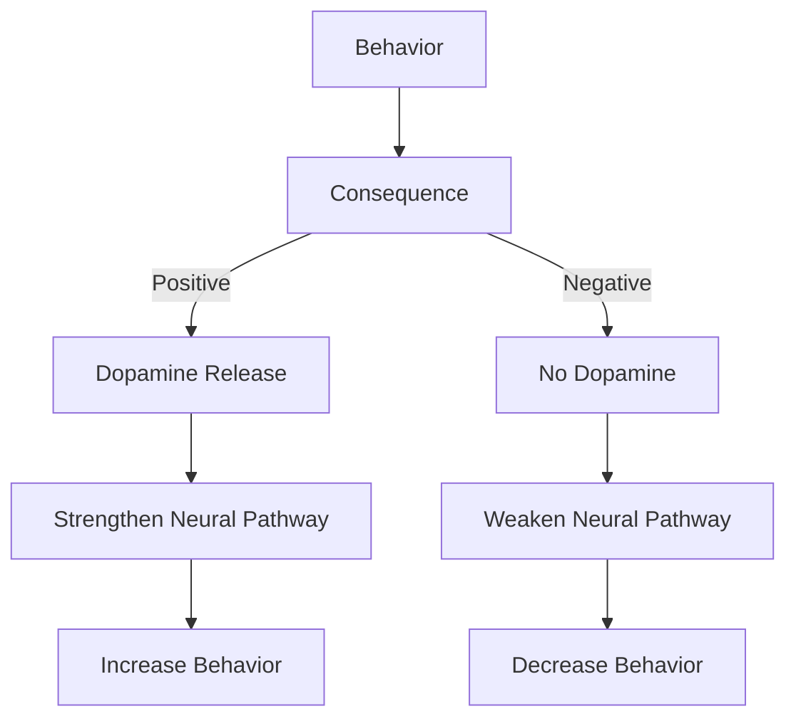
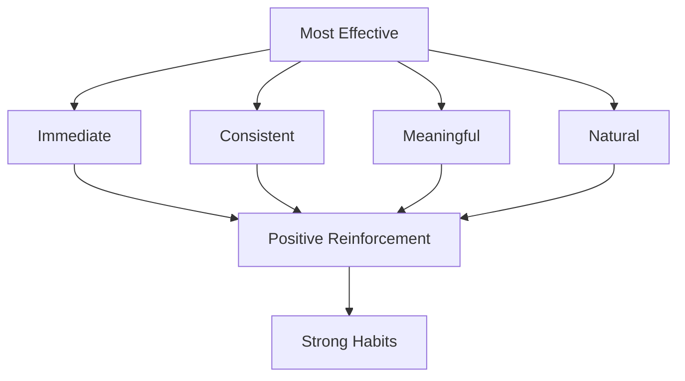

# Chapter 9: Behavioral Psychology - The Hidden Forces Shaping Your Actions

> **"Your behavior is influenced by forces you are not aware of."**

---

## 🎯 Learning Objectives
1. Understand the principles of behavioral psychology
2. Learn how conditioning shapes your habits
3. Discover the power of reinforcement and punishment
4. Apply behavioral psychology to habit formation and change

---

## 🧠 The Foundations of Behavioral Psychology

### What is Behavioral Psychology?
Study of **observable behaviors** and how they are influenced by **environmental factors**:
- Observable actions (not internal states)
- Environmental influences (not personality traits)
- Learning processes (not innate characteristics)
- Measurable outcomes (not subjective experiences)
> **💡 Key Insight:** All behaviors are learned and can be unlearned or modified.

### The Behaviorist Manifesto


**Core Principles:**
1. Behavior is learned - Not innate or inherited
2. Environment shapes behavior - Internal states are less important
3. Learning is through experience - Not through reasoning or insight
4. Focus on what can be observed - Not on subjective experiences
5. Experimental methods - Controlled studies to understand behavior

---

## 🔄 Classical Conditioning: Learning Through Association

### The Story of Pavlov's Dogs
Ivan Pavlov discovered classical conditioning while studying digestion:
```mermaid
sequenceDiagram
    participant Food
    participant Dog
    participant Bell
    participant Salivation
    Food->>Dog: Unconditioned stimulus
    Dog->>Salivation: Unconditioned response
    Bell->>Dog: Neutral stimulus (no response)
    Food+Bell->>Dog: Paired stimuli
    Dog->>Salivation: Response to both
    Bell->>Dog: Conditioned stimulus
    Dog->>Salivation: Conditioned response
```

**Key Terms:**
- **Unconditioned Stimulus (UCS)** - Naturally triggers a response (food)
- **Unconditioned Response (UCR)** - Natural response to UCS (salivation)
- **Neutral Stimulus** - Initially doesn't trigger a response (bell)
- **Conditioned Stimulus (CS)** - Learned to trigger a response (bell after conditioning)
- **Conditioned Response (CR)** - Learned response to CS (salivation to bell)

### Classical Conditioning in Habit Formation
1. **Cue-Habit Associations** - Brain associates cues with habits
2. **Emotional Conditioning** - Habits associated with emotions
3. **Context Conditioning** - Habits associated with specific contexts

---

## 🎯 Operant Conditioning: Learning Through Consequences

### The Skinner Box
B.F. Skinner developed operant conditioning through experiments:


**Key Concept:** Behaviors are shaped by their **consequences**.

### The Four Types of Operant Conditioning


| Type | Definition | Example | Effect on Behavior |
|------|------------|---------|-------------------|
| Positive Reinforcement | Adding a reward | Giving candy for good behavior | Increases behavior |
| Negative Reinforcement | Removing a negative | Taking painkillers | Increases behavior |
| Positive Punishment | Adding a negative | Scolding for bad behavior | Decreases behavior |
| Negative Punishment | Removing a reward | Taking away toy | Decreases behavior |

> **💡 Memory Tip:** Positive = Adding, Negative = Removing, Reinforcement = Increase, Punishment = Decrease

---

## 🧩 The Power of Reinforcement

### Why Reinforcement Works


**The Neuroscience:** Positive consequences → Dopamine release → Strengthens neural pathways → Increases behavior

### Types of Reinforcers
1. **Primary Reinforcers** - Naturally rewarding (food, water, sex)
2. **Secondary Reinforcers** - Learned to be rewarding (money, praise)
3. **Social Reinforcers** - From social interactions (praise, attention)
4. **Intrinsic Reinforcers** - Internal rewards (pride, satisfaction)
5. **Extrinsic Reinforcers** - External rewards (money, prizes)

### The Reinforcement Hierarchy


**For Maximum Effectiveness:**
1. **Immediate** - The sooner the better (within seconds)
2. **Consistent** - Every time the behavior occurs
3. **Meaningful** - Valued by the individual
4. **Natural** - Part of the behavior itself

---

## 🛠️ Practical Applications

### Strategy 1: The Reinforcement Design System
1. **Identify the Behavior** - What specific habit?
2. **Choose the Reinforcer** - Immediate, consistent, meaningful
3. **Determine the Schedule** - Start with continuous, transition to partial
4. **Implement the System** - Set up cues, deliver reinforcer, track progress
5. **Fade the Reinforcer** - Gradually reduce external reinforcers

### Strategy 2: The Habit Reinforcement Matrix
```markdown
| Habit | Immediate Reinforcer | Long-term Reinforcer | Schedule |
|-------|---------------------|---------------------|----------|
| Exercise | Smoothie | Better health | Continuous → Variable Ratio |
| Meditation | Calm feeling | Reduced stress | Continuous → Variable Interval |
| Reading | Interesting content | Knowledge | Variable Interval |
```

### Strategy 3: The Premack Principle
**Formula:** If [Low-Probability Behavior], then [High-Probability Behavior]
**Examples:**
- "If I exercise for 30 minutes, then I can watch TV"
- "If I finish my work, then I can play video games"
- "If I eat my vegetables, then I can have dessert"

### Strategy 4: The Token Economy
Use tokens that can be exchanged for larger rewards:
```markdown
## My Habit Token System
**Tokens Earned:**
- Exercise: 1 token per session
- Meditation: 1 token per session
- Reading: 1 token per 30 minutes

**Token Redemption:**
- 5 tokens: Favorite coffee drink
- 10 tokens: New book
- 20 tokens: Movie night
- 50 tokens: Massage
```

---

## ❌ Common Mistakes
❌ Using punishment as primary method
✅ Focus on reinforcement of desired behaviors

❌ Delaying reinforcement
✅ Deliver reinforcers immediately

❌ Using inconsistent reinforcement
✅ Be consistent with reinforcement

❌ Not fading external reinforcers
✅ Gradually reduce external reinforcers

---

## 📝 Step-by-Step Implementation
### Your 30-Day Reinforcement Plan
**Week 1:** Design Your System
**Week 2:** Implement and Track
**Week 3:** Optimize and Fade
**Week 4:** Maintain and Sustain

---

## ✅ Action Checklist
- [ ] Understand classical and operant conditioning
- [ ] Identify habits shaped by reinforcement/punishment
- [ ] Design a reinforcement system for a habit
- [ ] Choose effective reinforcers
- [ ] Implement your reinforcement system
- [ ] Track progress and adjust
- [ ] Fade external reinforcers
- [ ] Apply the Premack Principle

---

## 📚 References
1. Pavlov, I. P. (1927). Conditioned Reflexes. Oxford University Press.
2. Skinner, B. F. (1938). The Behavior of Organisms. Appleton-Century.
3. Skinner, B. F. (1953). Science and Human Behavior. Free Press.
4. Ferster, C. B., & Skinner, B. F. (1957). Schedules of Reinforcement. Appleton-Century-Crofts.
5. Bandura, A. (1977). Social Learning Theory. Prentice Hall.
6. Rescorla, R. A., & Wagner, A. R. (1972). A theory of Pavlovian conditioning. Classical Conditioning II.
7. Premack, D. (1965). Reinforcement theory. Nebraska Symposium on Motivation.
8. Martin, G., & Pear, J. (2015). Behavior Modification. Routledge.
9. Kazdin, A. E. (2013). Behavior Modification in Applied Settings. Waveland Press.
10. Duhigg, C. (2012). The Power of Habit. Random House.