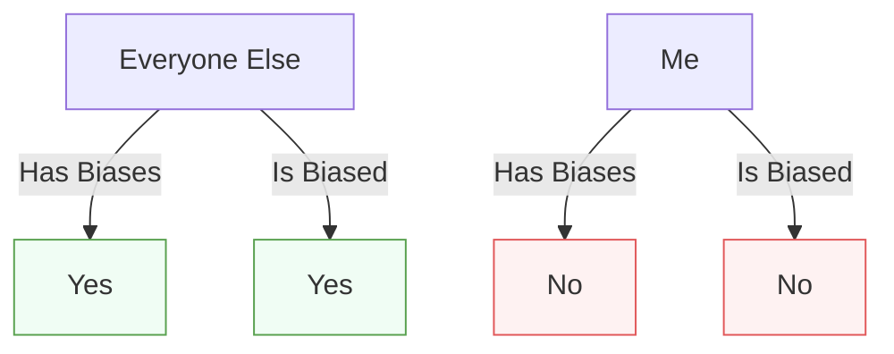

# Chapter 10: Cognitive Biases and How They Sabotage Your Habits

> **"Your brain takes shortcuts that can lead you astray."**

---

## 🎯 Learning Objectives
1. Understand what cognitive biases are and how they work
2. Learn the most common cognitive biases affecting habits
3. Discover how biases sabotage your habit formation efforts
4. Apply strategies to overcome cognitive biases

---

## 🧠 What Are Cognitive Biases?

### The Mental Shortcut
Cognitive biases are **systematic patterns of deviation** from rationality in judgment. They are **mental shortcuts** that allow us to make quick decisions, process large amounts of information, and conserve cognitive energy.

However, these shortcuts can lead to:
- Irrational decisions
- Faulty judgments
- Poor habit choices
- Self-sabotage
> **💡 Key Insight:** Cognitive biases are **not flaws** - they are **evolutionary adaptations** that help us survive. But they can **work against us** in the modern world.

### The Bias Blind Spot


**The Bias Blind Spot:** The tendency to see **other people** as biased, while believing **you** are objective.
> **📊 Research Insight:** **85% of people** believe they are **less biased** than the average person (Pronin et al., 2004).

---

## 🚨 Cognitive Biases That Sabotage Habits

### 1. Present Bias: The Procrastination Trap
**Definition:** Overvaluing immediate rewards at the expense of long-term benefits.
**How it sabotages habits:** Choosing short-term pleasure over long-term benefits, procrastinating, failing to start habits.
**Overcoming:** Make future rewards tangible, create immediate rewards, use commitment devices, break into small steps, design environment.

### 2. Status Quo Bias: The Resistance to Change
**Definition:** Preference for maintaining the current state, even when change would be beneficial.
**How it sabotages habits:** Resisting new habits, sticking with bad habits, avoiding effort.
**Overcoming:** Highlight costs of status quo, start small, use 5-second rule, find social support, celebrate small wins.

### 3. Confirmation Bias: The Echo Chamber
**Definition:** Seeking, interpreting, and remembering information that confirms existing beliefs.
**How it sabotages habits:** Only noticing supporting information, ignoring contrary evidence, resisting better approaches.
**Overcoming:** Actively seek disconfirming evidence, play devil's advocate, surround with diverse perspectives, keep decision journal, set up accountability.

### 4. Sunk Cost Fallacy: The Concordia Effect
**Definition:** Continuing an endeavor based on past investments, even when no longer beneficial.
**How it sabotages habits:** Continuing bad habits, refusing to quit, wasting more resources.
**Overcoming:** Ask "If starting today, would I choose this?", focus on future costs/benefits, set cut-off points, reframe quitting as smart, celebrate pivoting.

### 5. Planning Fallacy: The Optimism Trap
**Definition:** Underestimating time, costs, and risks of future actions, while overestimating benefits.
**How it sabotages habits:** Underestimating time to form habits, overestimating accomplishments, setting unrealistic goals, giving up.
**Overcoming:** Use reference class forecasting, add buffer time, break into tiny steps, start with one habit, track progress.

### 6. Loss Aversion: The Fear of Losing
**Definition:** Preferring avoiding losses over acquiring equivalent gains (losses feel 2-2.5x more powerful).
**How it sabotages habits:** Avoiding new habits due to fear, sticking with bad habits, overvaluing losses.
**Overcoming:** Reframe losses as gains, start small, use loss framing, create safety nets, celebrate small wins.

### 7. Overconfidence Bias: The Dunning-Kruger Effect
**Definition:** Overestimating knowledge, skills, or abilities, especially in areas of limited competence.
**How it sabotages habits:** Overestimating ability, underestimating effort, setting unrealistic expectations, ignoring advice.
**Overcoming:** Adopt growth mindset, seek feedback, test knowledge, start small, embrace humility.

### 8. The Spotlight Effect: The Illusion of Attention
**Definition:** Overestimating how much others notice and care about your actions.
**How it sabotages habits:** Fear of judgment prevents trying, worrying about appearance, overestimating consequences.
**Overcoming:** Realize most people are focused on themselves, ask "Will anyone remember this?", start small/private, embrace vulnerability, focus on your why.

---

## 🛠️ Strategies to Overcome Cognitive Biases

### Strategy 1: The Bias Awareness Framework
1. **Identify the Bias** - Which bias is affecting your thinking?
2. **Acknowledge the Bias** - Accept that it exists
3. **Challenge the Bias** - Ask "What's the evidence for and against?"
4. **Override the Bias** - Use strategies to counteract
5. **Prevent Future Bias** - Design systems to reduce bias

### Strategy 2: The Decision-Making Checklist
Before making habit-related decisions, ask:
```markdown
### The Cognitive Bias Checklist
**Present Bias**
- [ ] Am I overvaluing short-term rewards?
- [ ] Am I undervaluing long-term benefits?

**Status Quo Bias**
- [ ] Am I resisting change just because it's new?

**Confirmation Bias**
- [ ] Am I only seeking confirming information?

**Sunk Cost Fallacy**
- [ ] Am I continuing just because of past investment?

**Planning Fallacy**
- [ ] Am I underestimating time/effort?

**Loss Aversion**
- [ ] Am I overvaluing what I might lose?

**Overconfidence Bias**
- [ ] Am I overestimating my abilities?

**Spotlight Effect**
- [ ] Am I overestimating how much others care?
```

### Strategy 3: The Bias-Busting Habit System
| Bias | How It Affects Habits | Habit Design Solution |
|------|---------------------|------------------------|
| Present Bias | Overvalues short-term | Make habits immediately rewarding |
| Status Quo Bias | Resists change | Start with tiny changes |
| Confirmation Bias | Ignores disconfirming | Actively seek feedback |
| Sunk Cost Fallacy | Continues failing | Set clear cut-off points |
| Planning Fallacy | Underestimates effort | Break into tiny steps |
| Loss Aversion | Fears losing | Reframe losses as gains |
| Overconfidence | Overestimates abilities | Seek feedback |
| Spotlight Effect | Fears judgment | Start private |

### Strategy 4: The Pre-Mortem Technique
Imagine your habit has failed, then work backwards:
1. **Imagine Failure** - "It's 30 days from now, and my habit has failed. What happened?"
2. **Identify Causes** - List all possible reasons
3. **Develop Prevention Strategies** - For each cause, develop a strategy
4. **Implement Safeguards** - Put systems in place

---

## ❌ Common Mistakes
❌ Assuming you're immune to biases
✅ Everyone has biases - awareness is first step

❌ Trying to eliminate all biases
✅ Biases serve a purpose - work with them

❌ Not considering biases in habit design
✅ Design habits that account for cognitive tendencies

---

## 📝 Step-by-Step Implementation
### Your 30-Day Bias-Busting Plan
**Week 1:** Awareness (Learn, Identify, Track, Analyze, Choose, Develop, Implement)
**Week 2:** Challenge (Actively challenge, Use frameworks, Apply checklists, Practice devil's advocate)
**Week 3:** Design (Design habits, Use bias-busting system, Implement pre-mortems, Refine)
**Week 4:** Sustain (Sustain habits, Review, Adjust, Celebrate, Plan continued awareness)

---

## ✅ Action Checklist
- [ ] Learn about common cognitive biases
- [ ] Identify which biases affect your habits
- [ ] Track bias-related thoughts
- [ ] Challenge biased thinking
- [ ] Design bias-busting habits
- [ ] Implement pre-mortems
- [ ] Review and adjust strategies
- [ ] Celebrate improved decision-making

---

## 📚 References
1. Kahneman, D., & Tversky, A. (1974). Judgment under Uncertainty. Science.
2. Tversky, A., & Kahneman, D. (1974). Judgment under uncertainty. Science.
3. Kahneman, D. (2011). Thinking, Fast and Slow. Farrar, Straus and Giroux.
4. Ariely, D. (2008). Predictably Irrational. HarperCollins.
5. Pronin, E., Gilovich, T., & Ross, L. (2004). Objectivity in the eye of the beholder. Psychological Review.
6. Dunning, D., et al. (2003). Why people fail to recognize their own incompetence. Current Directions in Psychological Science.
7. Gilovich, T., Griffin, D., & Kahneman, D. (2002). Heuristics and Biases. Cambridge University Press.
8. Buehler, R., Griffin, D., & Ross, M. (1994). Exploring the planning fallacy. Journal of Personality and Social Psychology.
9. Kahneman, D., & Tversky, A. (1979). Prospect Theory. Econometrica.
10. Gilovich, T., Medvec, V. H., & Chen, S. (1995). Commission, omission, and dissonance reduction. Personality and Social Psychology Bulletin.