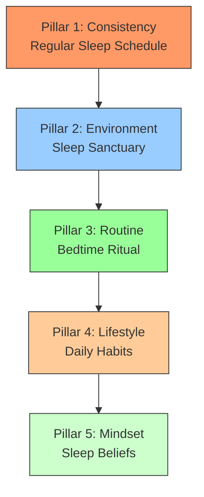

# Chapter 21: The Science of Sleep - Optimizing Your Most Important Habit

> **Part 6: Health Habits** | *Chapter 21 of 51*

---

## Learning Objectives

By the end of this chapter, you will be able to:
- Understand the critical role sleep plays in physical and mental health
- Explain the science of circadian rhythms and sleep stages
- Identify the consequences of poor sleep on cognition, mood, and productivity
- Apply evidence-based strategies to improve sleep quality and duration
- Design an optimal sleep environment using the Sleep Sanctuary Framework
- Implement a consistent bedtime routine that signals sleep to your brain
- Use the 90-Minute Rule to align with your natural sleep cycles
- Overcome common sleep disorders using behavioral and lifestyle interventions
- Track and optimize your sleep using validated assessment tools
- Create long-term sleep habits that support overall well-being

---

## Research Insights: The Science of Sleep

### Why Sleep is Your Most Important Habit

Sleep is the foundation of all other habits. Without quality sleep:
- Cognitive function declines by 20-30% (Alhola & Polo-Kantola, 2008)
- Emotional regulation becomes unstable (Goldstein & Walker, 2014)
- Immune system weakens by 50% (Besedovsky et al., 2012)
- Productivity drops significantly (Rosekind et al., 2010)
- Risk of chronic diseases increases (Cappuccio et al., 2011)

Key Statistic: After 24 hours without sleep, cognitive performance equals BAC of 0.10% (Dawson & Reid, 1997).

### The Circadian Rhythm: Your Internal Clock

Your body operates on a 24-hour biological clock controlled by the suprachiasmatic nucleus (SCN) in your hypothalamus.

Key Functions Regulated:
- Sleep-wake cycle
- Hormone release (cortisol, melatonin, growth hormone)
- Body temperature
- Metabolism and digestion
- Cognitive performance
- Mood and emotions

Chronotypes (Individual Differences):
- Morning Lark (15-20%): Peak performance in morning, bedtime 9-10 PM, wake 5-6 AM
- Hummingbird (60-70%): Balanced, peak midday, bedtime 10-11 PM, wake 6-7 AM
- Night Owl (15-20%): Peak performance evening, bedtime 12-1 AM, wake 8-9 AM

Genetic Basis: Chronotype is 40-50% heritable (Arnenz et al., 2019).

### The Sleep Cycle: 90-Minute Cycles

Sleep occurs in 90-minute cycles consisting of stages:
- N1 (Light Sleep): 1-5 min, transition, theta waves, initial relaxation
- N2 (True Sleep): 10-25 min, body temp drops, sleep spindles, physical recovery begins
- N3 (Deep Sleep): 20-40 min, very difficult to wake, delta waves, physical restoration, immune boost, memory consolidation
- REM (Rapid Eye Movement): 10-60 min, vivid dreaming, body paralyzed, beta waves, cognitive restoration, memory processing, emotional regulation, creativity

Typical Progression:
Cycle 1: N1 (5) -> N2 (15) -> N3 (30) -> N2 (10) -> REM (10)
Cycle 2: N2 (10) -> N3 (25) -> N2 (10) -> REM (15)
Cycle 3: N2 (10) -> N3 (20) -> N2 (10) -> REM (20)

Key Insight: Deep sleep dominates first half, REM dominates second half.

### Sleep Stages and Functions

| Stage | Duration | Key Functions | Deficiency Consequences |
|-------|----------|----------------|----------------------------|
| N1 | 5% | Transition to sleep | Difficulty falling asleep |
| N2 | 50% | Physical preparation | Reduced physical recovery |
| N3 | 20-25% | Physical restoration, immune boost, memory consolidation | Increased inflammation, weakened immunity, poor memory |
| REM | 20-25% | Cognitive restoration, emotional processing, creativity | Poor learning, emotional instability, reduced creativity |

### Consequences of Poor Sleep

Cognitive: Memory impairment 40%, attention reduction 25-50%, risky decisions +60%, creativity -30%, learning -40%
Emotional: Depression risk x5, anxiety +30%, emotional regulation -60%, stress +37%
Physical: Immune function -50%, obesity risk +55%, heart disease +48%, life expectancy -12%, pain sensitivity +25%
Productivity: Performance -29%, errors +20%, accidents +70%, absenteeism +45%

Global Statistics:
- 33% of adults report insufficient sleep
- 45% report poor sleep affects daily activities
- 60% experience sleep problems weekly
- 30% sleep less than 7 hours/night

Economic Impact: US loses $411B/year (2.28% GDP), Japan $138B (2.92% GDP), Germany $60B (1.56% GDP)

---

## The Sleep Optimization Framework

### The 5 Pillars of Optimal Sleep

### Pillar 1: Consistency - The Power of Regularity

The Circadian Advantage: Your body thrives on predictability. Consistent sleep/wake times optimize your circadian rhythm.

Benefits of Consistency:
- Easier to fall asleep
- Deeper sleep
- Easier to wake up
- Better mood
- Improved cognition

Consistency Guidelines:
- Fixed wake time every day (including weekends)
- Consistent bedtime within 30-minute window
- Keep sleep midpoint consistent
- If napping, keep it consistent

The Weekend Rule: Do not sleep in more than 1 hour past regular wake time.

Travel Adjustment:
- 1-2 time zones: Adjust by 30-60 min/day
- 3-4 time zones: Adjust by 1-2 hours/day
- 5+ time zones: Use melatonin 0.5-3mg 30 min before target bedtime

### Pillar 2: Environment - The Sleep Sanctuary

Optimal conditions: Cool, dark, quiet, comfortable.

Temperature:
- Ideal: 60-67 F (15-19 C)
- Body temp needs to drop 2-3 F to initiate sleep
- Solutions: Fans, AC, open windows, warm bath 1-2h before bed

Light:
- Complete darkness essential for melatonin
- Blue light most disruptive (suppresses melatonin by 50%)
- Solutions: Blackout curtains, sleep mask, remove electronics, red/amber bulbs, blue light filters

Noise:
- Aim for <30 decibels
- Consistent noise better than intermittent
- Solutions: Earplugs, white noise machine, fan

Comfort:
- Supportive mattress (replace every 7-10 years)
- Supportive pillow (replace every 1-2 years)
- Breathable bedding
- Loose clothing
- Good air quality

Sleep Sanctuary Checklist:
- [ ] Room temp 60-67 F
- [ ] Complete darkness
- [ ] Quiet <30 decibels
- [ ] Comfortable mattress/pillow
- [ ] Clean, clutter-free
- [ ] Good air quality
- [ ] No electronic screens
- [ ] Reserved for sleep/intimacy only

### Pillar 3: Routine - The Bedtime Ritual

90-Minute Wind-Down: Your body needs 90 minutes to transition from wakefulness to sleep.

Optimal Wind-Down Activities:
| Time Before | Activity | Duration |
|-------------|----------|----------|
| 90 min | Finish work | 15 min |
| 75 min | Light stretching/yoga | 15 min |
| 60 min | Read fiction | 20 min |
| 40 min | Warm bath/shower | 15 min |
| 25 min | Journal/meditate | 10 min |
| 15 min | Brush teeth/skincare | 10 min |
| 5 min | Gratitude practice | 5 min |

Activities to Avoid Before Bed:
- Screens (blue light)
- Work (stress)
- Intense exercise (raises temp/heart rate)
- Heavy meals (discomfort)
- Caffeine (stimulant)
- Alcohol (disrupts REM)
- Nicotine (stimulant)
- Stressful conversations

10-3-2-1-0 Rule (Dr. Craig Hudson):
- 10h before bed: No caffeine
- 3h before bed: No food/alcohol
- 2h before bed: No work
- 1h before bed: No screens
- 0: Snooze button hits

### Pillar 4: Lifestyle - Daily Habits

Morning Habits:
- 15-30 min sunlight within 1h of waking
- Drink water to rehydrate
- Light movement (stretching, walking)
- Protein-rich breakfast

Daytime Habits:
- 30 min moderate exercise (morning/afternoon best)
- 90-min work blocks with 20-min breaks
- Balanced meals
- Stay hydrated, reduce liquids 2h before bed
- Naps: 20-30 min before 3 PM

Evening Habits:
- Light, early dinner (2-3h before bed)
- Avoid caffeine after 2 PM
- Avoid alcohol within 3h of bed
- Practice relaxation (PMR, deep breathing)

Nutrition for Sleep:
| Food | Effect | Best Time |
|------|--------|-----------|
| Tryptophan (turkey, eggs) | Promotes melatonin/serotonin | Dinner/bedtime |
| Magnesium (spinach, almonds) | Relaxes muscles/nerves | Dinner/bedtime |
| Complex carbs (oatmeal) | Promotes tryptophan uptake | Dinner |
| Calcium (dairy, greens) | Helps brain use tryptophan | Dinner/bedtime |
| Kiwi | Contains serotonin | Bedtime |
| Tart cherry juice | Natural melatonin | 30 min before bed |

### Pillar 5: Mindset - The Psychology of Sleep

Sleep Beliefs to Adopt:
1. Sleep is a priority
2. Sleep is non-negotiable
3. Sleep is productive
4. Sleep is a skill
5. Sleep is individual

Sleep Anxiety Solutions:
- CBT-I (gold standard)
- Paradoxical intention (try to stay awake)
- Sleep restriction therapy
- Stimulus control therapy

The Sleep Effort Paradox: The harder you try to sleep, the less likely you succeed. Relax and let sleep come.

Mindfulness for Sleep:
- Body scan meditation
- Breath awareness
- Guided imagery
- Progressive muscle relaxation

---

## Practical Applications: Sleep Optimization Strategies

### Strategy 1: The 90-Minute Rule
Align sleep/wake times with 90-minute cycles to wake refreshed.

How to Use:
1. Calculate ideal bedtime working backwards from wake time in 90-min increments
2. Set alarm for end of cycle (7.5, 9, or 10.5 hours after bedtime)
3. Go to bed at calculated time, fall asleep within 15-20 min
4. Wake at end of complete cycle

Example: Wake at 6:30 AM
- 5 cycles (7.5h): Bedtime 11:00 PM
- 6 cycles (9h): Bedtime 9:30 PM

Benefits: More refreshed, reduced sleep inertia, improved cognition, better mood.

### Strategy 2: The Two-Sleep Solution
Biphasic sleep pattern with 20-30 min nap.

Science: Historical precedence (Wehr, 1992), cognitive benefits (alertness +100%, performance +34%), memory boost (Mednick, 2003), mood enhancement (Faraut, 2015).

How to Nap:
- Timing: 20-30 min
- Time of day: 1-4 PM
- Environment: Dark, quiet, comfortable
- Set alarm
- Caffeine nap: Drink coffee before napping

Nap Types:
| Type | Duration | Benefits | Best For |
|------|----------|----------|----------|
| Power | 10-20 min | Quick alertness boost | Afternoon slump |
| Standard | 20-30 min | Improved cognition | Mental fatigue |
| Full Cycle | 90 min | Complete cycle, REM | Memory, creativity |

### Strategy 3: The Sleep Banking Method
Preventively extend sleep before expected deprivation.

Science: Improves cognitive performance during deprivation (Ruxton, 2016), 1 extra hour/night for 1 week = 6-7h reserve.

How to Use:
1. Identify period of expected deprivation
2. Bank 1-2 extra hours/night for 1-2 weeks before
3. Maintain baseline during event
4. Repay debt after event

Limitations: Not substitute for consistent sleep, temporary buffer (1-2 nights), does not prevent all cognitive decline.

### Strategy 4: The Military Sleep Method
2-minute technique to fall asleep quickly.

Science: Developed for fighter pilots, based on PMR and visualization, 96% effective after 6 weeks (BudWinter, 1981).

How to Do:
1. Relax face completely
2. Drop shoulders, relax neck/traps
3. Exhale fully, relax chest/lungs
4. Relax legs (thighs -> calves -> feet)
5. Clear mind: Visualize canoe on calm lake OR repeat Dont think
6. Fall asleep within 2 minutes

Tips: Practice 6-8 weeks, use every night, ensure conducive environment, be patient.

### Strategy 5: The Sleep Restriction Protocol
Temporary restriction of time in bed to increase sleep efficiency.

Science: Developed by Arthur Spielman (1987), based on conditioning, increases sleep pressure.

How to Use:
1. Calculate sleep efficiency: (Time Asleep / Time in Bed) x 100
2. Set initial sleep window:
   - Efficiency <85%: Reduce by 15-30 min
   - 85-90%: Reduce by 15 min
   - >90%: Maintain
3. Consistent schedule
4. Avoid napping
5. Gradually increase by 15 min every 1-2 weeks if efficiency >90%
6. Continue until desired duration

Example:
Week 1: Sleep 6h, in bed 8h, efficiency 75% -> New window 7.5h
Week 2: Sleep 6.5h, in bed 7.5h, efficiency 87% -> New window 7.75h
Week 3: Sleep 7h, in bed 7.75h, efficiency 90% -> New window 8h

Important: Do not reduce below 5h, consult doctor if sleep apnea, not suitable for everyone.

---

## Common Sleep Disorders and Solutions

### Insomnia
Difficulty falling/staying asleep despite opportunity.

Types: Onset (falling), Maintenance (staying), Terminal (waking early).

Symptoms: >30 min to fall asleep, frequent awakenings, early waking, daytime fatigue, anxiety.

Causes: Stress/anxiety, poor habits, medical conditions, medications, mental health, substances.

Solutions: CBT-I (gold standard), sleep restriction, stimulus control, paradoxical intention, PMR, mindfulness, lifestyle changes.

CBT-I Components: Cognitive therapy, behavioral therapy, sleep education, sleep restriction, stimulus control.

### Sleep Apnea
Breathing disorder with repeated interruptions.

Types: Obstructive (OSA - blocked airway), Central (CSA - brain signal failure), Complex (combination).

Symptoms: Loud snoring, gasping/choking, frequent awakenings, daytime sleepiness, morning headaches, poor concentration, irritability.

Causes: Obesity, anatomy, age, gender (men 2-3x), family history, alcohol/sedatives, smoking.

Solutions:
- Lifestyle: Weight loss, exercise, avoid alcohol/sedatives, quit smoking, side sleeping
- CPAP: Gold standard for moderate-severe OSA, 100% effective when used correctly, 40-60% compliance
- Oral appliances: Custom-fitted, reposition jaw
- Surgery: Widen airway
- Positional therapy: Prevent back sleeping

### Restless Legs Syndrome (RLS)
Uncontrollable urge to move legs, usually with uncomfortable sensations.

Symptoms: Crawling/tingling/burning, urge to move, worsens at rest, evening/night, temporary relief from movement.

Causes: Iron deficiency, genetics (40-60%), pregnancy, medications, chronic diseases, caffeine/alcohol/nicotine.

Solutions:
- Lifestyle: Exercise (50% reduction), avoid triggers, leg massage, warm baths, good sleep hygiene
- Iron supplementation
- Medications: Dopamine agonists, alpha-2-delta ligands, opioids
- Compression devices, vibrating pads

### Narcolepsy
Neurological disorder with excessive daytime sleepiness and sudden sleep attacks.

Symptoms: EDS, cataplexy (sudden muscle tone loss), sleep paralysis, hypnagogic hallucinations, automatic behaviors.

Causes: Loss of orexin, genetics (90%), autoimmune, environmental triggers.

Solutions:
- Lifestyle: Scheduled naps (2-3x 10-20 min), good sleep hygiene, avoid triggers, exercise
- Medications: Stimulants (modafinil), antidepressants (SSRIs), sodium oxybate
- Support groups, workplace accommodations

### Parasomnias
Undesirable behaviors/experiences during sleep.

Types:
| Type | Characteristics | When | Treatment |
|------|----------------|------|-----------|
| Sleepwalking | Complex behaviors | NREM | Sleep hygiene, stress management, safety |
| Sleep talking | Talking | Any | Usually none, address stress |
| Night terrors | Intense fear | NREM | Sleep hygiene, stress, safety |
| Nightmares | Disturbing dreams | REM | Address stress/trauma, imagery rehearsal |
| REM Behavior | Acting out dreams | REM | Safety, address neurological |
| Sleep eating | Eating during sleep | NREM | Sleep hygiene, address disorders |
| Sexsomnia | Sexual behaviors | NREM | Sleep hygiene, stress, safety |

Causes: Genetics, sleep deprivation, stress, medications, substances, medical conditions.

Solutions: Improve sleep hygiene, address stress, safety precautions, avoid triggers, treat underlying conditions, medications.

---

## Common Mistakes and How to Avoid Them

1. Ignoring Sleep Problems -> Take seriously, seek help
2. Inconsistent Schedule -> Fixed wake/bed time, weekend rule
3. Screens Before Bed -> Avoid 1h before, 10-3-2-1-0 rule
4. Late Caffeine -> Avoid after 2 PM
5. Alcohol Before Bed -> Avoid within 3h, disrupts REM
6. Late Exercise -> Finish 3h before bed
7. Heavy Meals -> Light, early dinner (2-3h before)
8. Long/Late Naps -> 20-30 min, before 3 PM
9. Non-Sleep Bed Use -> Reserve for sleep/intimacy, get out after 20 min awake
10. Not Addressing Underlying Issues -> Identify and address root causes

---

## Myths vs Evidence

1. Myth: Catch up on weekends. Reality: Cannot fully repay debt, cumulative effects (AASM, 2019)
2. Myth: Older adults need less sleep. Reality: Needs same, less efficient (NSF, 2015)
3. Myth: Snoring harmless. Reality: Can indicate sleep apnea, health risks (AASM, Punjabi 2009)
4. Myth: Function fine on 5-6h. Reality: Serious cognitive/health consequences (UCSF, Ohayon 2017)
5. Myth: TV helps sleep. Reality: Disrupts architecture, reduces REM 20%, deep sleep 15% (NSF, 2020)
6. Myth: Alcohol helps sleep. Reality: Disrupts REM, increases fragmentation (UM, Ebrahim 2013)
7. Myth: Stay in bed if cant sleep. Reality: Conditions brain to wakefulness, get out after 20 min (SCT, Bootzin 1978)
8. Myth: Napping is lazy. Reality: Natural/healthy, boosts alertness 100%, cognition 34% (Harvard, Dhand 2006)
9. Myth: Cant control dreams. Reality: Can influence via lucid dreaming (UL, Stumbrys 2012)
10. Myth: Sleeping pills best solution. Reality: Short-term only, CBT-I gold standard (AASM, Trauer 2015)

---

## Step-by-Step Implementation: 30-Day Sleep Optimization

### Step 1: Assess Current Sleep
Track for 7-14 days: bedtime, sleep latency, wake time, time in bed, time asleep, awakenings, sleep quality, daytime functioning.

Tracking Methods: Sleep diary, fitness tracker, smartphone app, wearable device.

Calculate Metrics:
- Sleep Efficiency: (Time Asleep / Time in Bed) x 100
- Sleep Latency: Time to fall asleep
- WASO: Time awake after sleep onset
- Average Duration: Total asleep / nights

### Step 2: Set Sleep Goals
Recommended Duration (NSF, 2015):
- Adults (18-64): 7-9 hours
- Older adults (65+): 7-8 hours

Set Goals:
- Duration: 7-9h
- Efficiency: >85%
- Latency: <30 min
- WASO: <30 min
- Quality: >7/10
- Functioning: >7/10

### Step 3: Redesign Sleep Environment
Use Sleep Sanctuary Framework:
- Temperature: 60-67 F, use fans/AC, warm bath 1-2h before
- Light: Blackout curtains/mask, remove electronics, red bulbs, filters
- Noise: <30 decibels, earplugs, white noise, fan
- Comfort: Good mattress/pillow, breathable bedding, loose clothing, good air
- Reserve bed for sleep/intimacy only

### Step 4: Create Bedtime Routine
90-Minute Wind-Down:
- 90 min: Finish work
- 75 min: Light stretching/yoga
- 60 min: Read fiction
- 40 min: Warm bath/shower
- 25 min: Journal/meditate
- 15 min: Brush teeth/skincare
- 5 min: Gratitude

Customize with relaxing activities, avoid stimulating ones, dim lights gradually.

### Step 5: Optimize Lifestyle
Morning: Sunlight 15-30 min, water, light movement, protein breakfast.
Daytime: 30 min exercise, 90-min work blocks, balanced meals, hydrated.
Evening: Light early dinner, no caffeine after 2 PM, no alcohol 3h before, relaxation.

### Step 6: Implement and Track
Days 1-7: Focus on consistency, implement routine, optimize environment, track daily.
Days 8-21: Refine routine/environment, address obstacles, experiment, track.
Days 22-30: Habits feel natural, maintain consistency, increase duration if needed, prepare for maintenance.
Days 31+: Evaluate progress, adjust goals, create maintenance plan, continue tracking.

### Step 7: Troubleshoot and Adjust
If trouble falling asleep: Military method, 4-7-8 breathing, check routine/environment, address stress.
If wake during night: Dont check clock, if >20 min awake get out of bed, do relaxing activity, avoid screens.
If wake too early: Check sleep duration, ensure dark/quiet, address underlying issues, try relaxation.
If tired during day: Check night sleep, consider 20-30 min nap before 3 PM, hydrate/nourish, check medical conditions.

---

## Reflection Questions

### Sleep Assessment
1. Rate current sleep quality 1-10
2. Biggest sleep challenges
3. How poor sleep affects daily life
4. Past attempts to improve sleep
5. What worked/didnt

### Sleep Goals
6. Ideal duration/schedule
7. Perfect night of sleep
8. Benefits of better sleep
9. Obstacles to goals
10. How to overcome obstacles

### Sleep Environment
11. Rate current environment
12. Changes to improve
13. One small change tonight
14. Make bedroom more conducive
15. Distractions to eliminate

### Sleep Routine
16. Current bedtime routine
17. How it makes you feel
18. Ideal routine
19. Relaxing activities to add
20. Make routine more consistent

### Long-Term Sleep
21. Maintain improvements
22. Support needed
23. Handle setbacks
24. Long-term maintenance plan
25. Make sleep a priority

---

## Exercises

### Exercise 1: 7-Day Sleep Audit
Track sleep for 7 days, calculate metrics, identify patterns, note correlations.

### Exercise 2: Sleep Sanctuary Makeover
Assess environment, identify 3-5 changes, implement over 1 week, track impact.

### Exercise 3: Bedtime Routine Experiment
Design 90-min routine, follow for 7 days, track latency, note improvements.

### Exercise 4: 90-Minute Rule Challenge
Calculate ideal bedtime, use for 7 days, track quality/energy, note differences.

### Exercise 5: Two-Sleep Solution Trial
Take 20-30 min nap, track energy/mood/cognition, compare to no-nap day.

---

## Summary: Key Takeaways

1. Sleep is foundation of all habits
2. Circadian rhythm regulates sleep and functions
3. 90-minute cycles with deep sleep first half, REM second half
4. 5 Pillars: Consistency, Environment, Routine, Lifestyle, Mindset
5. Sleep Sanctuary: Cool, dark, quiet, comfortable
6. 90-Minute Wind-Down: Transition time for relaxing activities
7. 10-3-2-1-0 Rule: No caffeine/food/work/screens/snooze
8. Two-Sleep Solution: 20-30 min nap boosts alertness 100%, cognition 34%
9. Military Sleep Method: 2-min technique, 96% effective after 6 weeks
10. Sleep is a skill you can improve

---

## Action Checklist

### Immediate (Tonight)
- [ ] Track sleep 7 days
- [ ] Set consistent bedtime/wake time
- [ ] Remove electronics from bedroom
- [ ] Set room temp 60-67 F
- [ ] Use blackout curtains/mask
- [ ] Create simple bedtime routine

### This Week
- [ ] Complete 7-Day Sleep Audit
- [ ] Calculate sleep efficiency/metrics
- [ ] Identify biggest challenges
- [ ] Set sleep goals
- [ ] Redesign sleep environment
- [ ] Create bedtime routine
- [ ] Implement 10-3-2-1-0 Rule

### This Month
- [ ] Optimize lifestyle for sleep
- [ ] Try 90-Minute Rule for 7 days
- [ ] Experiment with Two-Sleep Solution
- [ ] Practice Military Sleep Method
- [ ] Track progress daily
- [ ] Conduct weekly reviews
- [ ] Address ongoing problems

### Long-Term
- [ ] Maintain sleep improvements
- [ ] Continue tracking/optimizing
- [ ] Create maintenance plan
- [ ] Share knowledge
- [ ] Advocate for sleep importance

---

## References

Key Studies:
1. Alhola & Polo-Kantola (2008) - Cognitive decline from sleep deprivation
2. Goldstein & Walker (2014) - Emotional regulation
3. Besedovsky et al. (2012) - Immune function
4. Rosekind et al. (2010) - Productivity loss
5. Cappuccio et al. (2011) - Chronic disease risk
6. Dawson & Reid (1997) - Cognitive performance = BAC 0.10%
7. Walker (2017) - Why We Sleep
8. Lally et al. (2009) - Habit formation
9. Gardner et al. (2014) - Missed opportunities
10. Ji & Wood (2013) - Context stability

Books:
1. Walker, M. (2017). Why We Sleep. Scribner.
2. Dement, W. C. (1999). The Promise of Sleep.
3. Roenneberg, T. (2012). Internal Time.
4. Breus, M. (2016). The Sleep Doctors Diet Plan.
5. Winter, W. C. (2017). The Sleep Solution.

---

## Next Steps

1. Start Sleep Audit: Track 7-14 days
2. Set Sleep Goals: Define ideal duration/schedule
3. Redesign Environment: Use Sleep Sanctuary Framework
4. Create Routine: 90-minute wind-down
5. Implement 10-3-2-1-0 Rule

Your Challenge: For next 7 days, prioritize sleep. Set consistent times, create routine, optimize environment, track progress.

> Pro Tip: Treat sleep as non-negotiable priority. Protect sleep time like important meeting. Make sleep your most important habit.

---

*Next: Chapter 22 - The Power of Nutrition: Fueling Your Habits for Success*